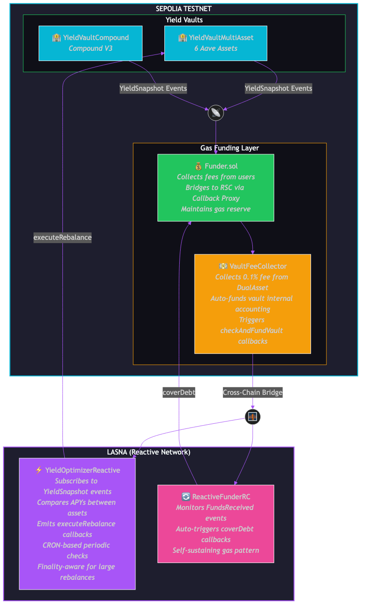

# YieldOpt Frontend - User Guide

## Quick Start

**Frontend URL:** `http://localhost:8080`

To start the frontend:
```bash
cd reactive-yield-optimizer/frontend
python3 -m http.server 8080
```

---

## Pages Overview

### 1. Dashboard (index.html)
The main overview of the entire yield optimization system.

### 2. Multi-Asset Vault (multiasset.html)
Manage the 6-asset yield vault with deposit, withdraw, and snapshot functionality.

### 3. Reactive Bridge (bridge.html)
Monitor and manage cross-chain gas funding.

### 4. Settings (settings.html)
View network connections and contract addresses.

### 5. Legacy Vaults (vault.html)
Monitor and manage Dual-Asset (USDC/DAI) and Compound vaults with True Auto-Replenishment status.

---

## Dashboard Features

### Total Value Locked (TVL)
Shows the combined value locked across all yield pools (Multi-Asset Vault + Compound V3).

### Best Yield (Real-Time)
Displays the highest current APY across all monitored assets with automatic identification of the best-performing asset.

### Asset APY Cards
Six cards showing live APYs for:
- WETH - Wrapped Ether
- LINK - Chainlink Token
- AAVE - Aave Governance Token
- EURS - Euro Stablecoin
- WBTC - Wrapped Bitcoin
- USDT - Tether USD

### Current Allocation
Doughnut chart showing the current allocation split between all assets and protocols.

### Yield History Chart
Line chart plotting historical APY values for monitored assets over time.

### Reactive Status Panel
Shows the state of the Reactive Smart Contract on Lasna:
- **CRON Monitoring** - Whether automated yield checks are active
- **CRON Interval** - Block interval between automated checks (e.g., 100 blocks)
- **Last Rebalance** - Block number of the last rebalance operation
- **Finality Mode** - Whether finality-aware mode is enabled for large rebalances

### Funder Gas Tank
Displays the cross-chain gas funding status:
- **Balance** - Current ETH balance in the Funder contract
- **Total Bridged** - Total ETH bridged to Reactive Network
- **Bridge Count** - Number of bridge operations completed
- **Can Bridge** - Whether threshold is met for a new bridge

---

## Multi-Asset Vault Operations

### Asset Selection
Choose from six supported assets:
- WETH (18 decimals)
- LINK (18 decimals)
- AAVE (18 decimals)
- EURS (2 decimals)
- WBTC (8 decimals)
- USDT (6 decimals)

### Actions
- **Deposit** - Add funds to the selected asset pool
- **Withdraw** - Remove funds from the vault

### Testnet Faucet
Quick access to mint test WBTC and USDT tokens for testing.

### Admin Zone
- **Trigger Yield Snapshot** - Manually triggers a yield snapshot event that will be processed by the RSC

### Vault Stats
- Last Rebalance time
- Total assets configured
- Current allocation percentages

### True Auto-Replenishment (New)
The legacy Dual-Asset vault now features a self-sustaining mechanism:
- **Service Fee** - Small fee (0.1% or min 0.0001 ETH) on deposits/withdrawals
- **Auto-Replenish Stats** - Shows total fees collected and funding cycles
- **Vault ETH Balance** - Monitors if vault has sufficient gas for callbacks

---

## Reactive Bridge

### Funder Contract Stats
- Gas tank balance visualization
- Total collected vs bridged amounts
- Bridge threshold and gas reserve settings

### Bridge Actions
- **Cover Debt** - Bridge funds to cover RSC debt
- **Bridge to Faucet** - Convert SepETH to REACT via faucet

### Auto-Refill Settings
Shows ReactiveFunderRC configuration:
- Refill threshold
- Faucet bridge amount
- Auto-refill enabled status

---

## Settings

### Network Connections
- Sepolia RPC status and endpoint
- Lasna RPC status and endpoint

### Deployed Contracts
All contract addresses with block explorer links:
- YieldVaultMultiAsset
- YieldVaultCompound
- Funder
- YieldOptimizerReactive (Lasna)
- ReactiveFunderRC (Lasna)

### Protocol Integrations
- Aave V3 Pool addresses
- Compound V3 Comet address
- Reactive Faucet address

---

## Backend Capabilities Showcased

### 1. Cross-Chain Yield Optimization
The frontend demonstrates the YieldVaultMultiAsset contract's ability to:
- Monitor yields across multiple DeFi protocols (Aave V3, Compound V3)
- Track real-time APY changes from on-chain data
- Maintain allocations based on yield performance

### 2. Reactive Smart Contracts (RSC)
The YieldOptimizerReactive contract on Lasna:
- **Event-Driven Automation** - Reacts to YieldSnapshot events from Sepolia
- **CRON Subscriptions** - Periodic yield checks via block-based CRON
- **Cross-Chain Callbacks** - Emits rebalance commands back to Sepolia
- **Finality-Aware Operations** - Delays large rebalances for safety

### 3. Self-Sustaining Gas Pattern
Demonstrated through the Funder + ReactiveFunderRC system:
- **Funder (Sepolia)** - Collects fees, bridges to RSC
- **ReactiveFunderRC (Lasna)** - Monitors and triggers auto-refills
- **Callback Proxy** - System contract for cross-chain deposits

### 4. Unified Oracle Integration
Live price data from:
- **reactive-bounty-1** - MultiFeedDestinationV2 for ETH, BTC, LINK
- **aggreatorv3-reactive-bridge-abstract** - AbstractFeedProxy for extensible feeds

### 5. Protocol Integrations
Live data from:
- **Aave V3** - getReserveData() for supply APY
- **Compound V3** - getSupplyRate() for yield calculation
- **Reactive Faucet** - SepETH to REACT conversion

---

## Wallet Connection

Click **"Connect Wallet"** in the top-right corner. Requirements:
- MetaMask or compatible wallet
- Connected to Sepolia testnet (Chain ID: 11155111)

The app will prompt to switch networks if needed.

---

## Understanding the Data

### APY Values
Displayed as percentages (e.g., 5.76%). Calculated from on-chain data in basis points (BPS), where 1% = 100 BPS.

### Allocation
Shown as percentages (e.g., WETH: 20%, LINK: 20%). Based on BPS where total = 10000.

### ETH Values
Funder balances shown in ETH format (e.g., 0.0050 ETH).

### Block Numbers
Rebalance timing shown as block numbers on Reactive Network.

---

## Important Notes

1. **Aave V3 Sepolia Supply Caps**: Some Aave V3 pools on Sepolia have supply caps. The Multi-Asset Vault uses assets with verified unlimited or high caps.

2. **Lasna Connectivity**: The Lasna RPC may occasionally be unreachable. The frontend handles this gracefully with "RPC Err" messages.

3. **No Private Keys**: The frontend never stores or handles private keys. All transactions are signed by your connected wallet.

4. **Testnet Only**: All contracts are deployed on Sepolia and Lasna testnets. No real value is at stake.

---

## Contract Architecture



The diagram above shows the complete contract architecture spanning both Sepolia and Lasna networks:

**Sepolia Layer:**
- **YieldVaultMultiAsset** - 6-asset Aave V3 vault
- **YieldVaultCompound** - Compound V3 vault
- **Funder** - Collects fees, bridges to RSC, maintains gas reserve
- **VaultFeeCollector** - 0.1% fee collection, auto-funds vault

**Lasna Layer (Reactive Network):**
- **YieldOptimizerReactive** - Subscribes to events, compares APYs, emits rebalance callbacks
- **ReactiveFunderRC** - Monitors funds, auto-triggers coverDebt, self-sustaining gas

---

## Key Features Demonstrated

1. **Yield Comparison Logic** - Optimal allocation to higher-yielding assets
2. **Cross-Chain Event Subscriptions** - Subscribe to Sepolia events from Lasna
3. **Callback Emissions** - Send executeRebalance commands cross-chain
4. **CRON Functionality** - Block-interval based periodic checks
5. **Finality-Aware Mode** - Wait for confirmations on large rebalances
6. **Self-Sustaining Gas** - Automatic RSC funding via Funder pattern
7. **Rate Limiting** - Minimum blocks between rebalance callbacks
8. **Multi-Protocol Support** - Aave V3 and Compound V3 integration
9. **Unified Oracle** - Combined price feeds from multiple sources

---

## Support

For issues or questions, refer to:
- [Reactive Network Docs](https://dev.reactive.network/)
- [Reactive Smart Contract Demos](https://github.com/Reactive-Network/reactive-smart-contract-demos)
