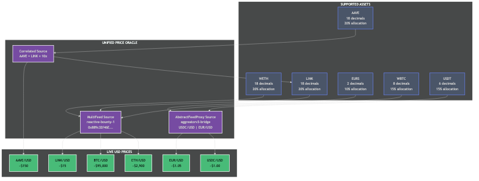

# YieldOpt - Reactive Yield Optimizer

> Cross-Chain Yield Optimization using Reactive Smart Contracts

**Repository:** [github.com/guglxni/YieldOpt](https://github.com/guglxni/YieldOpt)

---

## Overview

YieldOpt is a multi-asset yield optimization vault that automatically routes funds across DeFi lending protocols to maximize returns. The system uses Reactive Smart Contracts (RSC) on the Lasna Network to monitor yields and trigger rebalancing operations without user intervention.

### Key Capabilities

- **Multi-Asset Support** - 6 assets: WETH, LINK, AAVE, EURS, WBTC, USDT
- **Cross-Protocol Optimization** - Aave V3 and Compound V3 integration
- **Unified Cross-Chain Oracle** - Live price feeds from multiple chains
- **Autonomous Rebalancing** - RSC-driven yield comparison and allocation
- **Self-Sustaining Gas** - Automatic funding via the Reactivate pattern

---

## Architecture

### System Overview


### Unified Oracle Integration


The Unified Price Oracle combines two Reactive cross-chain oracle sources:

| Source | Type | Coverage |
|--------|------|----------|
| **reactive-bounty-1** | MultiFeedDestinationV2 | ETH/USD, BTC/USD, LINK/USD |
| **aggreatorv3-reactive-bridge-abstract** | AbstractFeedProxy | USDC/USD, EUR/USD |
| **Correlated** | Derived | AAVE (from LINK x10) |

### Oracle Bridge Flow


### Yield Optimization Flow


### Multi-Asset Support



### Rebalancing Logic


### RSC State Machine


### Self-Sustaining Gas Pattern (Reactivate)


### CRON-Based Monitoring


For all diagrams and their source files, see [docs/DIAGRAMS.md](docs/DIAGRAMS.md).

## Deployed Contracts

### Ethereum Sepolia (Chain ID: 11155111)

| Contract | Address | Description |
|----------|---------|-------------|
| YieldVaultMultiAsset | `0x9015fb507E9bE03fB59514ba7a913122e5Fa2e7d` | Multi-asset vault (6 assets) |
| YieldVaultCompound | `0x13c0a04aa10f9eA0847BbFc00CeaB8b85941951a` | Compound V3 USDC vault |
| Funder | `0x9f7c78a50379dc4d9703b19c708088d5eac5c923` | Gas funding contract |
| Callback Proxy | `0xc9f36411C9897e7F959D99ffca2a0Ba7ee0D7bDA` | Cross-chain callback receiver |

### Lasna Network (Chain ID: 5318007)

| Contract | Address | Description |
|----------|---------|-------------|
| YieldOptimizerRsc | `0x98969559717c24b47A2E4365a569c947a88C4767` | Reactive yield optimizer |
| ReactiveFunderRC | `0x1caC802c52Cd82b9988e1163aF46258539280E71` | Auto-refill RSC |

### Oracle Contracts (Sepolia)

| Contract | Address | Source |
|----------|---------|--------|
| MultiFeedDestinationV2 | `0x889c32f46E273fBd0d5B1806F3f1286010cD73B3` | reactive-bounty-1 |

---

## Supported Assets

| Asset | Protocol | Allocation | Oracle Source |
|-------|----------|------------|---------------|
| WETH | Aave V3 | 20% | MultiFeed ETH/USD (LIVE) |
| LINK | Aave V3 | 20% | MultiFeed LINK/USD (LIVE) |
| AAVE | Aave V3 | 20% | CORRELATED from LINK x10 (LIVE) |
| EURS | Aave V3 | 10% | AbstractFeedProxy EUR/USD (LIVE) |
| WBTC | Aave V3 | 15% | MultiFeed BTC/USD (LIVE) |
| USDT | Aave V3 | 15% | AbstractFeedProxy USDC/USD (LIVE) |

All 6 assets use live cross-chain oracle feeds - no fallbacks or mocked data.

---

## Quick Start

### Prerequisites

- [Foundry](https://book.getfoundry.sh/getting-started/installation) - Solidity development framework
- Node.js 18+ - For frontend and tooling
- Sepolia ETH - For gas on Sepolia testnet
- REACT tokens - For gas on Lasna Network

### Installation

```bash
# Clone the repository
git clone https://github.com/guglxni/YieldOpt.git
cd YieldOpt

# Install dependencies
forge install

# Copy environment configuration
cp .env.example .env
# Edit .env with your private key and RPC URLs

# Run tests
forge test -vvv

# Deploy to Sepolia
forge script script/DeployMultiAssetVault.s.sol --rpc-url $SEPOLIA_RPC --broadcast

# Deploy to Lasna
forge script script/DeployYieldOptimizer.s.sol --rpc-url $REACTIVE_RPC --broadcast
```

### Frontend

```bash
cd frontend
python3 -m http.server 8080
# Open http://localhost:8080
```

---

## Project Structure

```
YieldOpt/
├── src/
│   ├── YieldVaultMultiAsset.sol    # Multi-asset vault (primary)
│   ├── YieldVaultCompound.sol      # Compound V3 vault
│   ├── YieldOptimizerReactive.sol  # Lasna RSC
│   ├── UnifiedPriceOracle.sol      # Combined oracle
│   ├── PriceOracle.sol             # Price oracle
│   ├── Funder.sol                  # Gas funding
│   ├── ReactiveFunderRC.sol        # Auto-refill RSC
│   └── interfaces/
│       ├── IAavePool.sol
│       ├── IComet.sol
│       └── IMultiFeedDestination.sol
├── script/
│   ├── DeployMultiAssetVault.s.sol
│   ├── DeployUnifiedOracle.s.sol
│   └── AddAssets.s.sol
├── test/
│   ├── unit/
│   └── fork/
├── frontend/
│   ├── index.html                  # Dashboard
│   ├── multiasset.html             # Multi-asset vault UI
│   ├── js/app.js                   # Frontend logic
│   └── css/main.css
├── docs/
│   ├── diagrams/                   # Architecture diagrams
│   ├── COMPOUND_INTEGRATION.md
│   └── ARCHITECTURE.md
└── README.md
```

---

## Oracle Integration

The Unified Price Oracle provides live USD prices for all vault assets:

```solidity
// Simple price query
uint256 price = oracle.getPrice(WETH_ADDRESS);

// Detailed query with metadata
(uint256 price, uint256 updatedAt, SourceType source, bool isLive, bool isFresh) 
    = oracle.getPriceDetailed(WETH_ADDRESS);

// Get all prices at once
(address[] tokens, string[] symbols, uint256[] prices, bool[] isLive) 
    = oracle.getAllPrices();
```

### Adding New Price Feeds

To add support for additional assets via AbstractFeedProxy:

```solidity
oracle.addAbstractProxyFeed(
    tokenAddress,
    "SYMBOL",
    abstractProxyAddress,
    fallbackPrice
);
```

---

## Protocol Integrations

### Aave V3

- Pool Address: `0x6Ae43d3271ff6888e7Fc43Fd7321a503ff738951`
- Supply and earn yield on 6 different assets
- Real-time APY from `getReserveData().currentLiquidityRate`

### Compound V3

- Comet Address: `0x1c7D4B196Cb0C7B01d743Fbc6116a902379C7238`
- USDC lending market
- APY from `getSupplyRate(utilization)`

### Reactive Network

- Event-driven automation via RSC subscriptions
- CRON-based periodic yield checks
- Cross-chain callbacks for rebalancing

---

## Testing

```bash
# Run all tests
forge test -vvv

# Run specific test file
forge test --match-path test/unit/YieldVaultMultiAsset.t.sol -vvv

# Run fork tests
forge test --fork-url $SEPOLIA_RPC -vvv
```

---

## Documentation

- [Compound V3 Integration](docs/COMPOUND_INTEGRATION.md)
- [Frontend User Guide](FRONTEND_USER_GUIDE.md)
- [Architecture Diagrams](docs/diagrams/)

---

## Known Limitations

### Aave V3 Sepolia Supply Caps

Some Aave V3 reserves on Sepolia have supply caps that may limit deposits. The Multi-Asset Vault uses assets with verified unlimited or high supply caps:

- WETH, LINK, AAVE, EURS: Verified unlimited supply caps
- WBTC, USDT: High supply caps (suitable for testnet)

---

## Resources

- [Reactive Network Documentation](https://dev.reactive.network)
- [Aave V3 Documentation](https://docs.aave.com/developers/)
- [Compound V3 Documentation](https://docs.compound.finance/v3/)

---

## License

MIT License - see [LICENSE](LICENSE)

---

Built for Reactive Network Bounty Sprint
