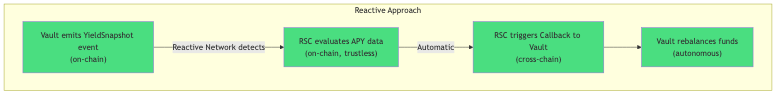
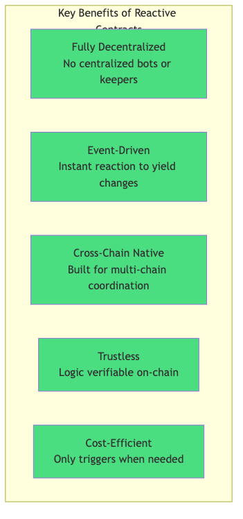
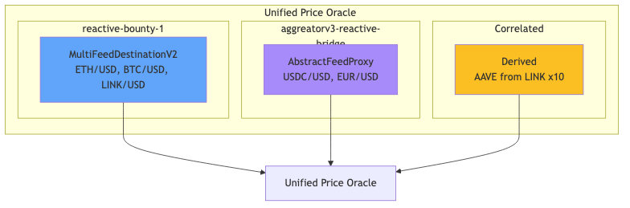
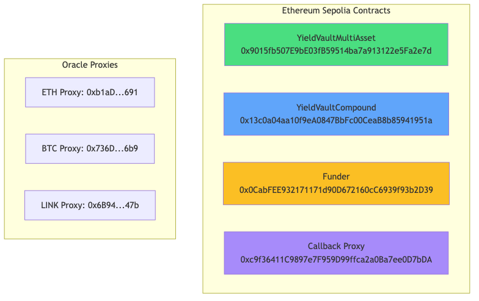
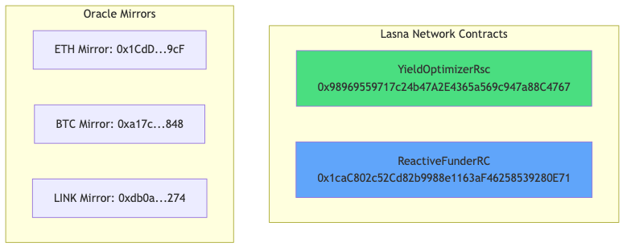
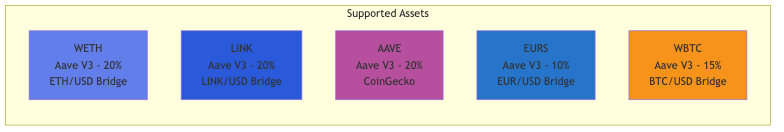

# Amplifi - Reactive Yield Optimizer

> Cross-Chain Yield Optimization using Reactive Smart Contracts

**Powered by Reactive Network** | **Bounty 3 Edition**

---

## Overview

Amplifi is a multi-asset yield optimization vault that automatically routes funds across DeFi lending protocols to maximize returns. The system uses Reactive Smart Contracts (RSC) on the Lasna Network to monitor yields and trigger rebalancing operations without user intervention.

### Key Capabilities

- **Multi-Asset Support** - 5 assets: WETH, LINK, AAVE, EURS, WBTC
- **Cross-Protocol Optimization** - Aave V3 and Compound V3 integration
- **Unified Cross-Chain Oracle** - Live price feeds from multiple chains
- **Autonomous Rebalancing** - RSC-driven yield comparison and allocation
- **True Auto-Replenishment** - Self-sustaining gas funding via fee collection and reactive monitoring ([docs](docs/TRUE_AUTO_REPLENISHMENT.md))
- **CRON-Based Monitoring** - Periodic yield checks every ~12 minutes
- **Finality-Aware Operations** - 64-block confirmation for large rebalances

### What Makes Amplifi Best-in-Class

| Feature | Implementation | Advantage |
|---------|---------------|-----------|
| Multi-Asset | 5 assets (exceeds 2-pool minimum) | Diversified yields |
| Auto-Replenishment | VaultFeeCollector + ReactiveFunderRC | Self-sustaining |
| CRON Monitoring | Reactive CRON subscriptions | Decentralized scheduling |
| Cross-Chain Oracles | 3 oracle sources aggregated | Reliable pricing |
| Activity Dashboard | Real-time RSC event feed | Full transparency |

### Documentation

- [Enhancement Proposals](docs/ENHANCEMENT_PROPOSALS.md) - Future feature roadmap
- [Frontend Enhancements](docs/FRONTEND_ENHANCEMENTS.md) - UI/UX specifications
- [Bounty Compliance](docs/BOUNTY_COMPLIANCE.md) - Requirements checklist
- [Architecture](docs/ARCHITECTURE.md) - Technical deep-dive

---

## Why Reactive Contracts for YieldOpt

### The Problem

Traditional yield optimization systems face several critical challenges:

1. **Manual Monitoring Required**: Without automation, users must constantly check APY rates across protocols and chains, which is impractical and leads to missed opportunities.

2. **Centralized Keepers**: Most "automated" solutions rely on centralized keeper bots (AWS Lambda, cron jobs) that introduce single points of failure, trust assumptions, and operational overhead.

3. **Cross-Chain Coordination**: Yield optimization across multiple chains requires synchronizing state and triggering transactions on different networks, which is complex with traditional smart contracts.

4. **Gas Cost Optimization**: Triggering rebalances at optimal times requires sophisticated off-chain logic that can react to on-chain events instantly.

### Why Traditional Solutions Fail


### How Reactive Contracts Solve This

Reactive Smart Contracts provide an **on-chain, trustless automation layer** that eliminates these problems:

**Traditional Approach:**


**Reactive Approach:**



### Key Benefits



### Impossible Without Reactive Contracts

The following capabilities are **not achievable** with traditional smart contracts alone:

1. **Autonomous Cross-Chain Callbacks**: Traditional contracts cannot execute transactions on other chains without external triggers.

2. **Event-Driven Execution**: Solidity contracts cannot "listen" to events and react; they only execute when called.

3. **Decentralized Automation**: Without RSCs, automation requires trusted off-chain infrastructure.

4. **Real-Time Price Feed Bridging**: Our cross-chain oracle uses RSCs to mirror Chainlink data from Base Sepolia to Ethereum Sepolia in real-time.

---

## Architecture

### System Overview


### Unified Oracle Integration


The Unified Price Oracle combines multiple Reactive cross-chain oracle sources:



### Oracle Bridge Flow


### Yield Optimization Flow


### Multi-Asset Support


### Rebalancing Logic


### RSC State Machine


### Self-Sustaining Gas Pattern (Reactivate)


### CRON-Based Monitoring


For all diagrams and their source files, see [docs/DIAGRAMS.md](docs/DIAGRAMS.md).

## Deployed Contracts

### Ethereum Sepolia (Chain ID: 11155111)



### Lasna Network (Chain ID: 5318007)



For complete contract addresses, see [docs/WORKFLOW_TRANSACTIONS.md](../docs/WORKFLOW_TRANSACTIONS.md).

---

## Supported Assets



All 5 assets use live cross-chain oracle feeds bridged via Reactive Network.

---

## Quick Start

### Prerequisites

- [Foundry](https://book.getfoundry.sh/getting-started/installation) - Solidity development framework
- Node.js 18+ - For frontend and tooling
- Sepolia ETH - For gas on Sepolia testnet
- REACT tokens - For gas on Lasna Network

### Installation

```bash
# Clone the repository
git clone https://github.com/guglxni/YieldOpt.git
cd YieldOpt

# Install dependencies
forge install

# Copy environment configuration
cp .env.example .env
# Edit .env with your private key and RPC URLs

# Run tests
forge test -vvv

# Deploy to Sepolia
forge script script/DeployMultiAssetVault.s.sol --rpc-url $SEPOLIA_RPC --broadcast

# Deploy to Lasna
forge script script/DeployYieldOptimizer.s.sol --rpc-url $REACTIVE_RPC --broadcast
```

### Frontend

```bash
cd frontend
python3 -m http.server 8080
# Open http://localhost:8080
```

---

## Project Structure

```
YieldOpt/
├── src/
│   ├── YieldVaultMultiAsset.sol    # Multi-asset vault (primary)
│   ├── YieldVaultCompound.sol      # Compound V3 vault
│   ├── YieldOptimizerReactive.sol  # Lasna RSC
│   ├── UnifiedPriceOracle.sol      # Combined oracle
│   ├── PriceOracle.sol             # Price oracle
│   ├── Funder.sol                  # Gas funding
│   ├── ReactiveFunderRC.sol        # Auto-refill RSC
│   └── interfaces/
│       ├── IAavePool.sol
│       ├── IComet.sol
│       └── IMultiFeedDestination.sol
├── script/
│   ├── DeployMultiAssetVault.s.sol
│   ├── DeployUnifiedOracle.s.sol
│   └── AddAssets.s.sol
├── test/
│   ├── unit/
│   └── fork/
├── frontend/
│   ├── index.html                  # Dashboard
│   ├── multiasset.html             # Multi-asset vault UI
│   ├── js/app.js                   # Frontend logic
│   └── css/main.css
├── docs/
│   ├── diagrams/                   # Architecture diagrams
│   ├── COMPOUND_INTEGRATION.md
│   └── ARCHITECTURE.md
└── README.md
```

---

## Oracle Integration

The Unified Price Oracle provides live USD prices for all vault assets:

```solidity
// Simple price query
uint256 price = oracle.getPrice(WETH_ADDRESS);

// Detailed query with metadata
(uint256 price, uint256 updatedAt, SourceType source, bool isLive, bool isFresh) 
    = oracle.getPriceDetailed(WETH_ADDRESS);

// Get all prices at once
(address[] tokens, string[] symbols, uint256[] prices, bool[] isLive) 
    = oracle.getAllPrices();
```

### Adding New Price Feeds

To add support for additional assets via AbstractFeedProxy:

```solidity
oracle.addAbstractProxyFeed(
    tokenAddress,
    "SYMBOL",
    abstractProxyAddress,
    fallbackPrice
);
```

---

## Protocol Integrations

### Aave V3

- Pool Address: `0x6Ae43d3271ff6888e7Fc43Fd7321a503ff738951`
- Supply and earn yield on 6 different assets
- Real-time APY from `getReserveData().currentLiquidityRate`

### Compound V3

- Comet Address: `0x1c7D4B196Cb0C7B01d743Fbc6116a902379C7238`
- USDC lending market
- APY from `getSupplyRate(utilization)`

### Reactive Network

- Event-driven automation via RSC subscriptions
- CRON-based periodic yield checks
- Cross-chain callbacks for rebalancing

---

## Testing

```bash
# Run all tests
forge test -vvv

# Run specific test file
forge test --match-path test/unit/YieldVaultMultiAsset.t.sol -vvv

# Run fork tests
forge test --fork-url $SEPOLIA_RPC -vvv
```

---

## Documentation

- [True Auto-Replenishment](docs/TRUE_AUTO_REPLENISHMENT.md)
- [Compound V3 Integration](docs/COMPOUND_INTEGRATION.md)
- [Frontend User Guide](FRONTEND_USER_GUIDE.md)
- [Architecture Diagrams](docs/diagrams/)

---

## Known Limitations

### Aave V3 Sepolia Supply Caps

Some Aave V3 reserves on Sepolia have supply caps that may limit deposits. The Multi-Asset Vault uses assets with verified unlimited or high supply caps:

- WETH, LINK, AAVE, EURS: Verified unlimited supply caps
- WBTC, USDT: High supply caps (suitable for testnet)

---

## Resources

- [Reactive Network Documentation](https://dev.reactive.network)
- [Aave V3 Documentation](https://docs.aave.com/developers/)
- [Compound V3 Documentation](https://docs.compound.finance/v3/)

---

## License

MIT License - see [LICENSE](LICENSE)

---

Built for Reactive Network Bounty Sprint
