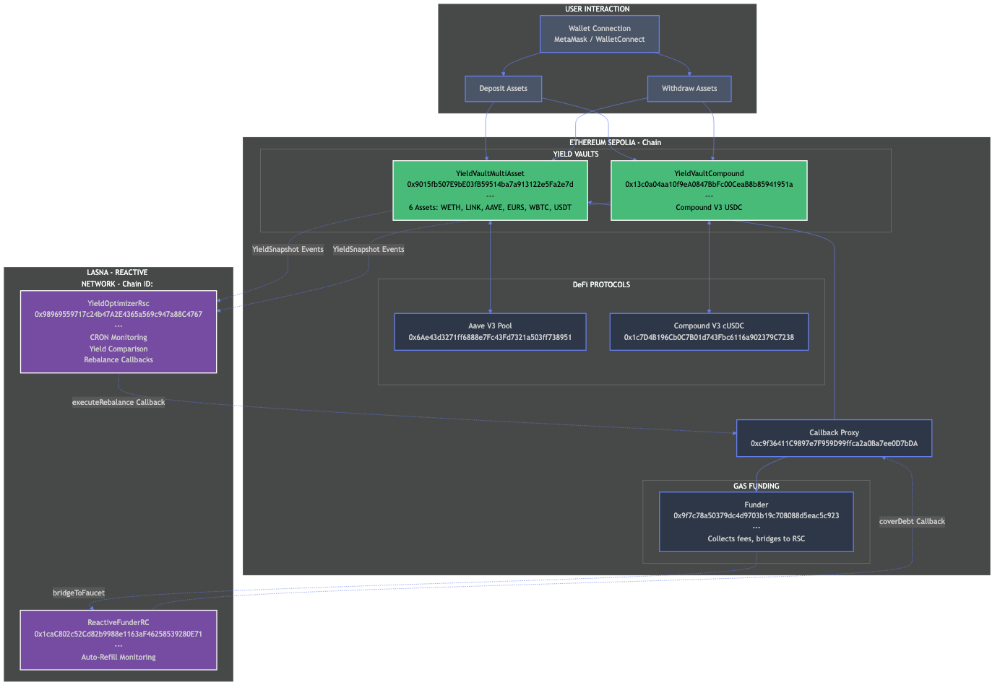
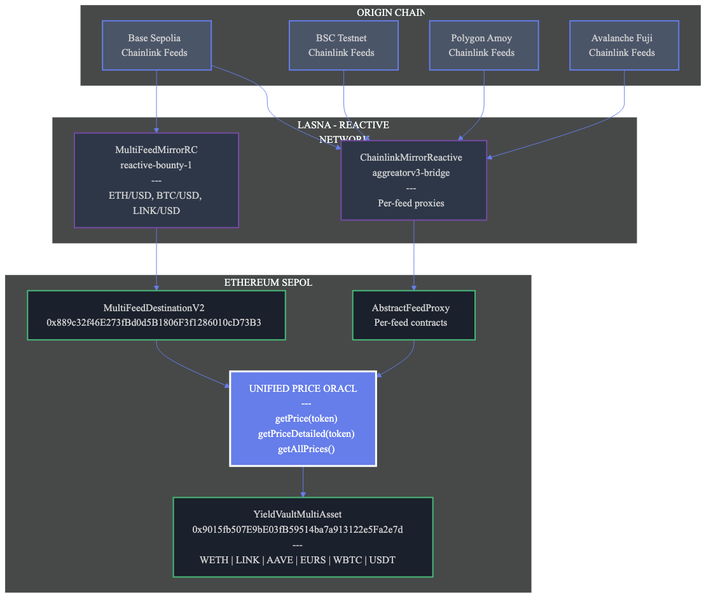
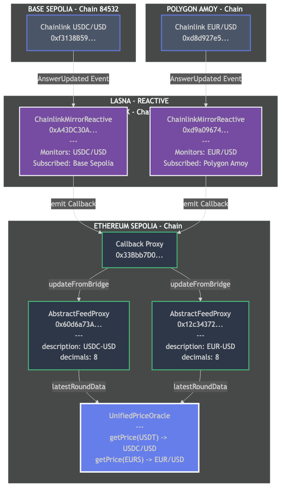
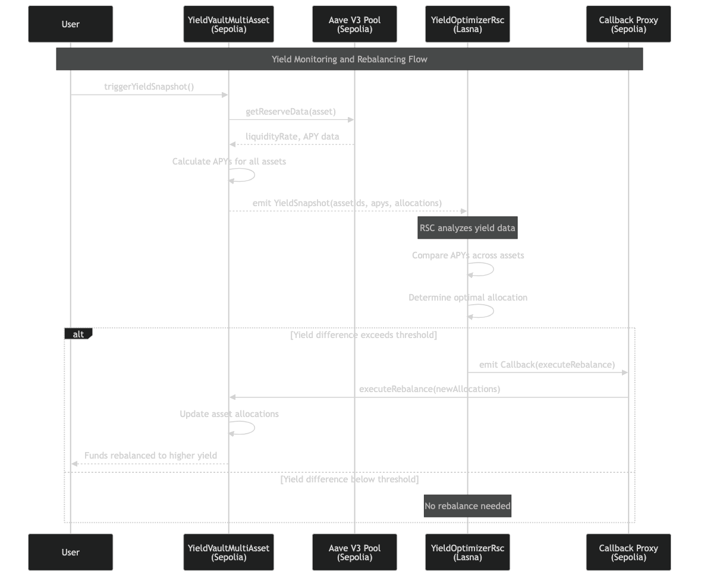
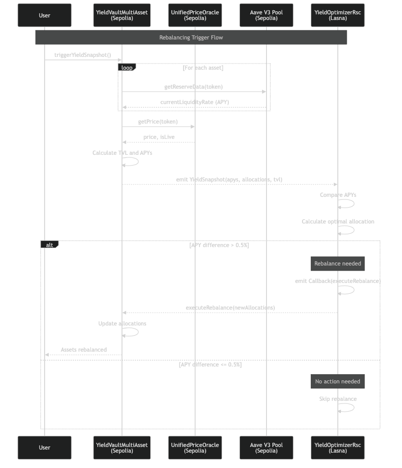
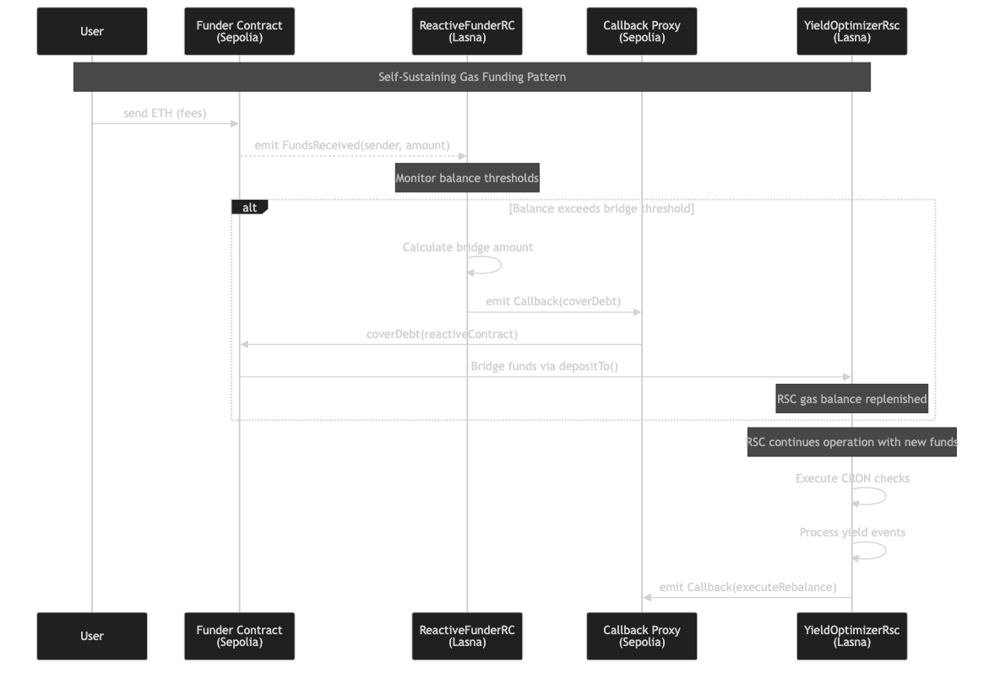
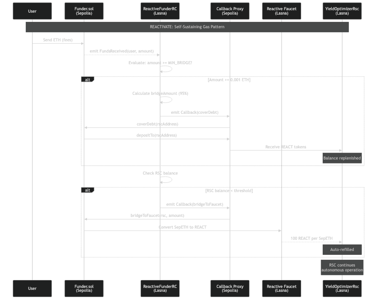
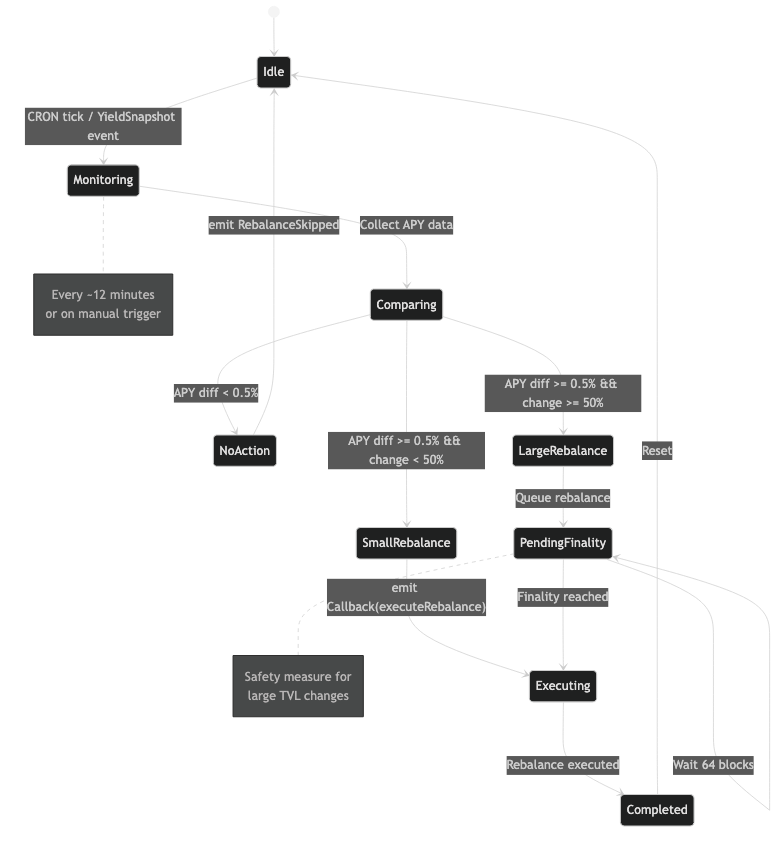
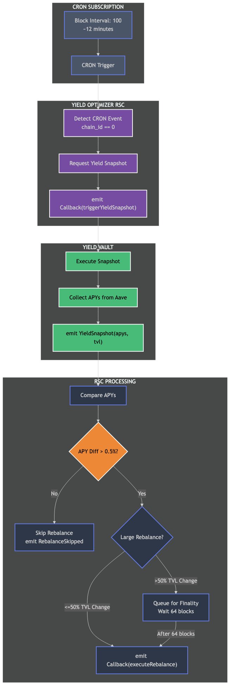

# YieldOpt Architecture

> Technical architecture documentation for the Reactive Yield Optimizer

---

## Overview

YieldOpt is composed of three interconnected layers:

1. **Sepolia Layer** - Yield vaults, DeFi protocol integrations, and the Unified Oracle
2. **Lasna Layer** - Reactive Smart Contracts for automation and cross-chain callbacks
3. **Oracle Layer** - Cross-chain price feeds from multiple sources

---

## System Architecture



### Components

#### Yield Vaults (Sepolia)

| Contract | Purpose |
|----------|---------|
| YieldVaultMultiAsset | Multi-asset Aave V3 vault with 6 supported tokens |
| YieldVaultCompound | Compound V3 USDC lending vault |
| Funder | Gas funding contract for cross-chain operations |

#### Reactive Smart Contracts (Lasna)

| Contract | Purpose |
|----------|---------|
| YieldOptimizerRsc | Monitors yield snapshots, triggers rebalancing |
| ReactiveFunderRC | Auto-refills RSC gas via bridge callbacks |

#### Oracle Integration (Sepolia)

| Contract | Purpose |
|----------|---------|
| UnifiedPriceOracle | Aggregates prices from multiple reactive oracle sources |
| MultiFeedDestinationV2 | Receives cross-chain Chainlink prices |

---

## Unified Oracle Architecture



The Unified Price Oracle combines two reactive cross-chain oracle implementations:

### Source 1: reactive-bounty-1 (MultiFeedDestinationV2)

- **Contract**: `0x889c32f46E273fBd0d5B1806F3f1286010cD73B3`
- **Type**: Multi-feed single contract
- **Origin Chain**: Base Sepolia
- **Feeds**: ETH/USD, BTC/USD, LINK/USD
- **Interface**: `latestRoundDataForFeed(originFeed)`

### Source 2: aggreatorv3-reactive-bridge-abstract (AbstractFeedProxy)

- **Type**: Per-feed proxy contracts
- **Origin Chains**: Base Sepolia, Polygon Amoy
- **Feeds**: USDC/USD, EUR/USD
- **Interface**: Standard `AggregatorV3Interface`

### Oracle Bridge Flow



### Source 3: Correlated Pricing

- **Type**: Derived from another token's price
- **Example**: AAVE = LINK × 10x multiplier
- **Interface**: Internal calculation

### Price Resolution Priority

```
1. Primary Source (MultiFeed or AbstractProxy)
   |
   +-- Success? --> Return live price
   |
   +-- Failure? --> Try Secondary Source
                    |
                    +-- Success? --> Return live price
                    |
                    +-- Failure? --> Return fallback price
```

---

## Yield Optimization Flow



### Step-by-Step Process

1. **Trigger**: User or CRON calls `triggerYieldSnapshot()` on vault
2. **Data Collection**: Vault fetches APY data from Aave V3 for all assets
3. **Event Emission**: `YieldSnapshot` event emitted with asset APYs
4. **RSC Processing**: YieldOptimizerRsc on Lasna receives event
5. **Analysis**: RSC compares APYs across assets
6. **Decision**: If yield difference exceeds threshold, RSC emits callback
7. **Execution**: Callback Proxy delivers `executeRebalance` to vault
8. **Rebalancing**: Vault adjusts allocations to favor higher-yielding assets

### Rebalance Threshold

```solidity
uint256 constant REBALANCE_THRESHOLD = 50; // 0.5% APY difference

if (bestAPY - currentAPY > REBALANCE_THRESHOLD * 1e23) {
    emit Callback(executeRebalance);
}
```

### Rebalancing Logic Detail



---

## Self-Sustaining Gas Pattern (Reactivate)



### Reactivate Pattern Details



### Components

#### Funder (Sepolia)

- Receives ETH from users (fees, donations)
- Maintains a gas reserve for operations
- Bridges excess funds to RSC via `coverDebt()`
- Supports faucet bridge for 100:1 REACT conversion

#### ReactiveFunderRC (Lasna)

- Monitors `FundsReceived` events from Funder
- Triggers `coverDebt` callback when balance threshold met
- Auto-refills RSC when balance drops below 1 REACT
- Ensures RSC always has gas for operations

### Funding Flow

```
User --> Funder (ETH)
              |
              +-- emit FundsReceived
              |
              v
         ReactiveFunderRC (Lasna)
              |
              +-- Check threshold
              |
              +-- emit Callback(coverDebt)
              |
              v
         Callback Proxy --> Funder
              |
              +-- depositTo(RSC)
              |
              v
         RSC Gas Replenished
```

---

## RSC State Machine



### States

| State | Description |
|-------|-------------|
| Idle | Waiting for CRON or YieldSnapshot events |
| Monitoring | Processing incoming event |
| Comparing | Analyzing APY differences |
| PendingFinality | Large rebalance queued (64 blocks) |
| Executing | Emitting rebalance callback |

---

## CRON-Based Monitoring



### CRON Configuration

```solidity
uint256 public cronInterval = 100; // ~12 minutes

service.subscribe(
    CRON_CHAIN_ID,    // 0 for CRON
    address(0),
    cronInterval,
    REACTIVE_IGNORE,
    REACTIVE_IGNORE,
    REACTIVE_IGNORE
);
```

---

## Contract Interactions

### Deposit Flow

```
User
  |
  +-- approve(vault, amount)
  |
  +-- deposit(assetId, amount)
        |
        +-- Vault: transferFrom(user, vault, amount)
        |
        +-- Vault: approve(aavePool, amount)
        |
        +-- Vault: aavePool.supply(token, amount, vault, 0)
        |
        +-- Vault: emit Deposited(user, assetId, token, amount)
```

### Rebalance Flow

```
YieldOptimizerRsc (Lasna)
  |
  +-- Receive YieldSnapshot event
  |
  +-- Compare APYs
  |
  +-- emit Callback(
        SEPOLIA_CHAIN_ID,
        vault,
        abi.encodeCall(executeRebalance, (newAllocations))
      )
        |
        v
Callback Proxy (Sepolia)
  |
  +-- vault.executeRebalance(newAllocations)
        |
        +-- Update allocation mappings
        |
        +-- emit Rebalanced(assetIds, newAllocations)
```

---

## Data Flow Diagram

```
+------------------+     +------------------+     +------------------+
|   Origin Chains  |     |      Lasna       |     |     Sepolia      |
|  (Base, BSC...)  |     | (Reactive Net)   |     |                  |
+------------------+     +------------------+     +------------------+
        |                        |                        |
        | Chainlink Prices       |                        |
        |----------------------->|                        |
        |                        | MultiFeedMirrorRC      |
        |                        |----------------------->|
        |                        |                        | MultiFeed
        |                        |                        | Destination
        |                        |                        |
        |                        |                        v
        |                        |              +------------------+
        |                        |              | UnifiedPriceOracle|
        |                        |              +------------------+
        |                        |                        |
        |                        |                        v
        |                        |              +------------------+
        |                        |              |YieldVaultMultiAsset|
        |                        |              +------------------+
        |                        |                        |
        |                        | YieldSnapshot Events   |
        |                        |<-----------------------|
        |                        |                        |
        |                        | YieldOptimizerRsc     |
        |                        |                        |
        |                        | executeRebalance      |
        |                        |----------------------->|
        |                        |                        |
```

---

## Security Considerations

### Access Control

| Function | Access |
|----------|--------|
| `addAsset()` | Owner only |
| `setAllocation()` | Owner only |
| `updateAssetPrice()` | Owner only |
| `executeRebalance()` | Callback Proxy only |
| `deposit()` | Any user |
| `withdraw()` | Asset owner only |

### Reentrancy Protection

All vault functions that transfer assets use the checks-effects-interactions pattern:

```solidity
function withdraw(uint256 assetId, uint256 amount) external nonReentrant {
    // Checks
    require(userBalances[msg.sender][assetId] >= amount, "Insufficient balance");
    
    // Effects
    userBalances[msg.sender][assetId] -= amount;
    
    // Interactions
    aToken.safeTransfer(msg.sender, amount);
}
```

### Oracle Staleness

The Unified Oracle rejects prices older than `MAX_STALENESS` (1 hour):

```solidity
bool isFresh = block.timestamp - updatedAt <= MAX_STALENESS;
```

---

## Gas Optimization

### Batch Operations

The `getAllAssets()` function returns all asset data in a single call:

```solidity
function getAllAssets() external view returns (
    uint256[] ids,
    address[] tokens,
    string[] symbols,
    uint256[] apys,
    uint256[] allocations,
    uint256[] balances
)
```

### Storage Packing

Asset structs are packed for gas efficiency:

```solidity
struct Asset {
    address token;          // 20 bytes
    address aToken;         // 20 bytes
    uint8 decimals;         // 1 byte
    uint256 allocation;     // 32 bytes (separate slot)
    uint256 priceUSD;       // 32 bytes (separate slot)
    bool active;            // 1 byte
    string symbol;          // dynamic
}
```

---

## Deployment Sequence

1. Deploy `UnifiedPriceOracle` with MultiFeed address
2. Deploy `YieldVaultMultiAsset` with Aave Pool address
3. Add assets to vault via `addAsset()`
4. Set initial allocations via `setAllocation()`
5. Deploy `YieldOptimizerRsc` on Lasna with vault address
6. Deploy `Funder` on Sepolia
7. Deploy `ReactiveFunderRC` on Lasna
8. Fund RSC via Funder

---

## Resources

- [Reactive Network Documentation](https://dev.reactive.network)
- [Aave V3 Developer Docs](https://docs.aave.com/developers/)
- [Compound V3 Technical Reference](https://docs.compound.finance/v3/)
