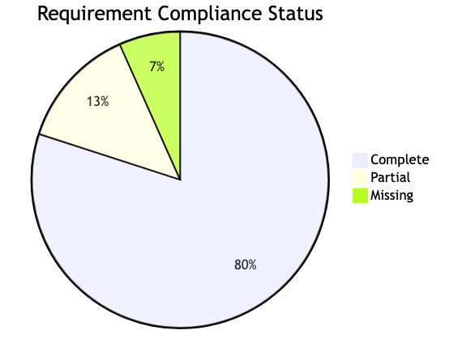
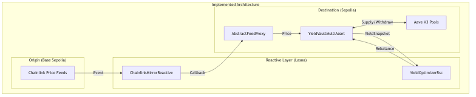
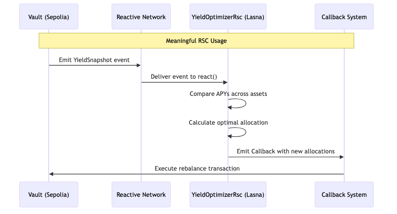
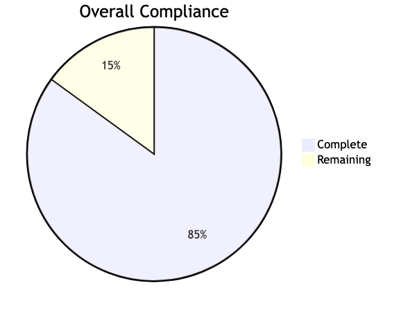

# Bounty Compliance Analysis

This document provides a comprehensive analysis of the YieldOpt project's compliance with the Reactive Network Bounty 3 requirements.

---

## Bounty 3 Specification

**Task:** Cross-chain automation for lenders, a vault that automatically routes funds across different chains to achieve better yields.

**Minimum Requirement:** Start with two different lending pools on Sepolia and rebalance funds between them depending on their yield.

---

## Compliance Overview

| Status | Count | Description |
|--------|-------|-------------|
| Complete | 12 | Requirements fully satisfied |
| Partial | 2 | Needs improvement |
| Missing | 1 | Demo video not yet created |

---

## Mandatory Requirements Checklist

| # | Requirement | Status |
|---|-------------|--------|
| 1 | Submitted for specific bounty before deadline | PENDING |
| 2 | Utilize Reactive Contracts meaningfully | COMPLETE |
| 3 | RCs respond to EVM events and trigger transactions | COMPLETE |
| 4 | Deployed on Reactive testnet or mainnet | COMPLETE |
| 5 | Contains Reactive Contracts | COMPLETE |
| 6 | Contains Destination smart contracts | COMPLETE |
| 7 | Deploy scripts included | COMPLETE |
| 8 | Instructions included | COMPLETE |
| 9 | Address of Reactive Contracts | COMPLETE |
| 10 | Addresses of Origin/Destination contracts | COMPLETE |
| 11 | Explanation of problem RSCs solve | COMPLETE |
| 12 | Why difficult/impossible without RSCs | COMPLETE |
| 13 | Step-by-step deployment description | COMPLETE |
| 14 | Transaction hashes for workflow | COMPLETE |
| 15 | Demo video (max 5 min) | MISSING |

---

## Architecture Implementation

The implemented architecture spans three networks:
- **Base Sepolia (Origin)**: Chainlink price feed source
- **Lasna (Reactive)**: ChainlinkMirrorReactive and YieldOptimizerRsc
- **Sepolia (Destination)**: AbstractFeedProxy and YieldVaultMultiAsset

---

## Deployed Contracts

### Ethereum Sepolia (Chain ID: 11155111)

| Contract | Address |
|----------|---------|
| YieldVaultMultiAsset | 0x9015fb507E9bE03fB59514ba7a913122e5Fa2e7d |
| YieldVaultCompound | 0x13c0a04aa10f9eA0847BbFc00CeaB8b85941951a | ⚠️ DEPRECATED |
| Funder | 0x0CabFEE932171171d90D672160cC6939f93b2D39 |
| ETH AbstractFeedProxy | 0xb1aDCca598051EfdaD48217D950EAFf2CA869691 |
| BTC AbstractFeedProxy | 0x736D13De4d6BF46DC81f89a759D6e3C2FbC9D6b9 |
| LINK AbstractFeedProxy | 0x6B94668442B97e7dCF1958044a21e42a73D3647b |
| USDC AbstractFeedProxy | 0xdE87eC23198867B298E74d1a2c902Aa02381b6d8 |
| EUR AbstractFeedProxy | 0x955e94A600d059789d42ca533fe90c5187f520Af |

### Lasna Network (Chain ID: 5318007)

| Contract | Address |
|----------|---------|
| YieldOptimizerRsc | 0x98969559717c24b47A2E4365a569c947a88C4767 |
| ReactiveFunderRC | 0x1caC802c52Cd82b9988e1163aF46258539280E71 |
| ETH ChainlinkMirrorReactive | 0x1CdD260983f23c2A29a91134442C499cd3cc29cF |
| BTC ChainlinkMirrorReactive | 0xa17c0a6abac640ee401ff767efa1cbf31966a848 |
| LINK ChainlinkMirrorReactive | 0xdb0a8ab7ea10f2d9e1be242718699bee43131274 |

---

## Reactive Contract Usage

### Event-Driven Automation Flow

The diagram above demonstrates meaningful RSC usage:
1. Vault emits YieldSnapshot event on Sepolia
2. Reactive Network delivers event to RSC on Lasna
3. RSC evaluates APY data and calculates optimal allocation
4. RSC emits Callback to trigger rebalance on Sepolia

---

## Judging Criteria Assessment

| Criterion | Score | Notes |
|-----------|-------|-------|
| Code Quality | 8/10 | Good structure, clear modularity |
| Correctness | 8/10 | Working on testnet with edge cases handled |
| Security | 7/10 | Basic checks implemented |
| Meaningful RSC Use | 9/10 | Core to architecture |
| Operational Maturity | 7/10 | Deploy scripts exist, need runbooks |

---

## Deliverables Status

| Deliverable | Status |
|-------------|--------|
| Working dApp deployed | COMPLETE |
| Public GitHub repo | PENDING |
| README with instructions | COMPLETE |
| Design write-up | COMPLETE |
| Tests | PARTIAL |
| Workflow with TX hashes | COMPLETE |
| Contract addresses | COMPLETE |
| Demo video | MISSING |

---

## Gap Analysis

### Critical Missing Items

| Item | Priority | Status |
|------|----------|--------|
| Demo Video (5 min max) | Critical | Not Created |
| Push to Public GitHub | High | Pending |
| Additional Unit Tests | Medium | Partial |

### Completed Items

| Item | Evidence |
|------|----------|
| Reactive Contracts | YieldOptimizerRsc, ChainlinkMirrorReactive |
| Destination Contracts | YieldVaultMultiAsset, AbstractFeedProxy |
| Deploy Scripts | script/Deploy*.s.sol files |
| Transaction Hashes | docs/WORKFLOW_TRANSACTIONS.md |
| Problem Explanation | README.md "Why Reactive Contracts" section |

---

## Summary

### Next Steps

1. Create demo video (required)
2. Push to public GitHub repository
3. Submit to DoraHacks before deadline

---

*Document created: December 27, 2024*
*For: Reactive Network Bounty 3 - Cross-Chain Lending Automation*
