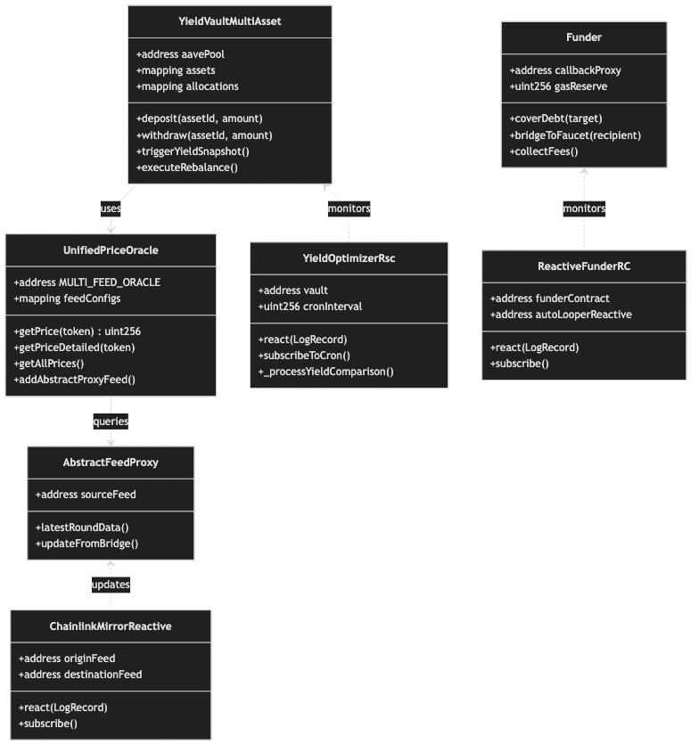
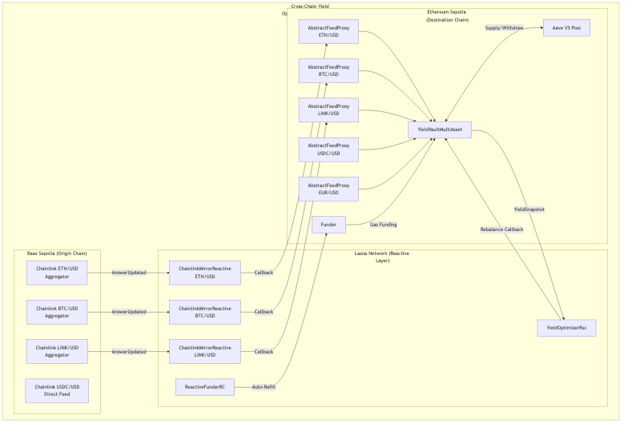
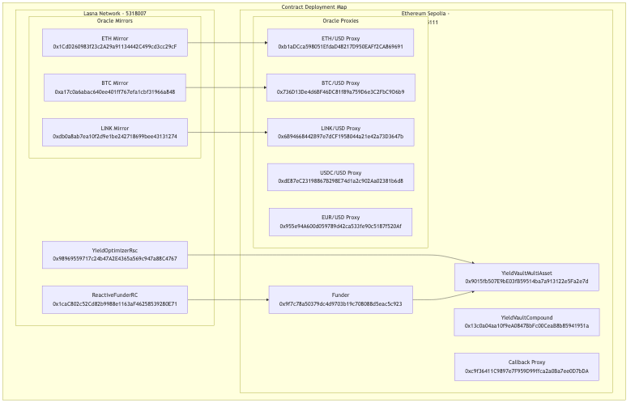
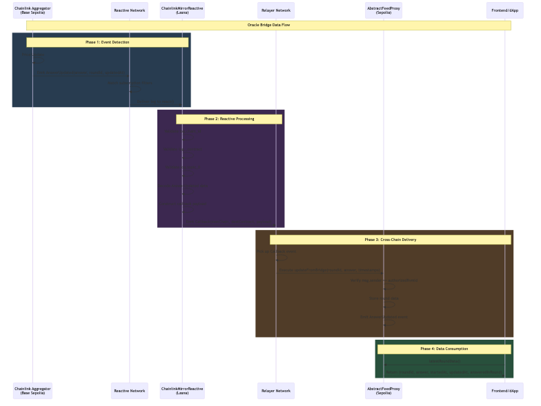
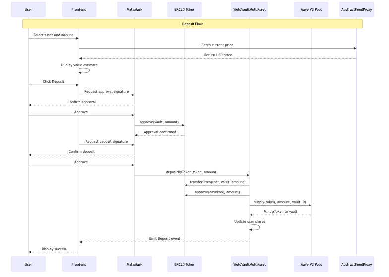
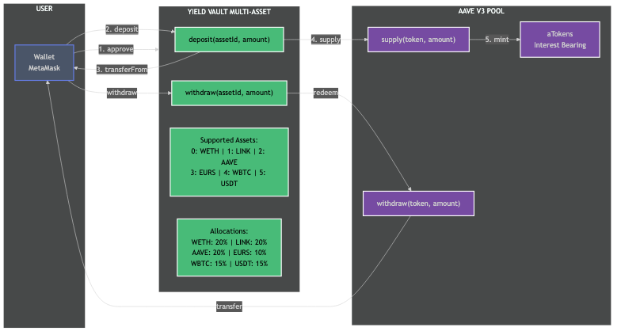

# YieldOpt Architecture Diagrams

> Visual documentation of the YieldOpt cross-chain yield optimization system

---

## Table of Contents

1. [System Overview](#system-overview)
2. [Cross-Chain Architecture](#cross-chain-architecture)
3. [Oracle Infrastructure](#oracle-infrastructure)
4. [Vault Operations](#vault-operations)
5. [Reactive Smart Contracts](#reactive-smart-contracts)
6. [Self-Sustaining Gas](#self-sustaining-gas)
7. [Contract Deployment](#contract-deployment)

---

## System Overview

### Unified System Architecture


The YieldOpt system spans multiple blockchains:
- **Ethereum Sepolia**: Main DeFi operations, Aave V3 integration
- **Lasna (Reactive Network)**: Autonomous monitoring and callbacks
- **Base Sepolia**: Chainlink price feed sources

### Contract Relationships



Key contract interactions:
- `YieldVaultMultiAsset` monitors `YieldOptimizerRsc`
- `AbstractFeedProxy` queries from `ChainlinkMirrorReactive`
- `Funder` monitors `ReactiveFunderRC`

---

## Cross-Chain Architecture

### Complete System Flow



The cross-chain architecture shows:
1. Chainlink aggregators on Base Sepolia emit price updates
2. ChainlinkMirrorReactive contracts on Lasna detect and process events
3. Callbacks update AbstractFeedProxy contracts on Sepolia
4. Vault consumes price data for TVL calculations

### Contract Deployment Map



Complete deployment map showing all contracts across:
- Ethereum Sepolia (8 contracts)
- Lasna Network (4 contracts)

---

## Oracle Infrastructure

### Unified Cross-Chain Oracle


The price oracle aggregates from multiple sources:
- **AbstractFeedProxy**: ETH, BTC, LINK, USDC, EUR from bridge
- **CoinGecko**: AAVE fallback price
- **Correlated**: Derived prices when needed

### Oracle Bridge Flow


Cross-chain price bridging architecture:
1. Chainlink emits `AnswerUpdated` on Base Sepolia
2. `ChainlinkMirrorReactive` on Lasna detects event
3. Callback triggers `updateFromBridge` on `AbstractFeedProxy`
4. Frontend queries updated price

### Oracle Bridge Sequence



Detailed sequence diagram showing:
- Phase 1: Event Detection
- Phase 2: Reactive Processing
- Phase 3: Cross-Chain Delivery
- Phase 4: Data Consumption

### Multi-Asset Support


All 5 supported assets with their oracle sources and allocations.

---

## Vault Operations

### Deposit Flow Detailed



Complete deposit sequence showing:
1. User interaction with frontend
2. MetaMask approval and signing
3. Token transfer to vault
4. Aave supply operation
5. Share issuance

### Vault Operations Overview



User interaction with the multi-asset vault:
1. User approves token spending
2. User deposits to vault
3. Vault supplies to Aave V3
4. Vault issues vault shares
5. User can withdraw anytime

### Yield Optimization Flow


Complete yield optimization sequence from detection to execution.

---

## Reactive Smart Contracts

### RSC State Machine


The YieldOptimizerRsc lifecycle states:
- **Idle**: Waiting for events
- **Monitoring**: Processing CRON or YieldSnapshot
- **Comparing**: Analyzing APY differences
- **PendingFinality**: Waiting for block finality (large rebalances)
- **Executing**: Triggering rebalance callback

### CRON-Based Monitoring


Periodic yield monitoring flow:
- CRON subscription triggers every ~12 minutes
- RSC requests yield snapshot from vault
- Vault collects APY data from Aave
- RSC compares and decides on rebalancing

### Rebalancing Logic


Detailed rebalancing sequence:
1. Collect APYs from all assets
2. Compare yield differences
3. Skip if below threshold
4. Queue large rebalances for finality
5. Execute via callback for normal rebalances

---

## Self-Sustaining Gas

### Reactivate Pattern


The Reactivate pattern ensures RSCs never run out of gas:
1. Users pay fees to `Funder` contract
2. `ReactiveFunderRC` detects fee payments
3. Triggers bridge to convert SepETH to REACT
4. Auto-refills RSC when balance drops below threshold

### Gas Funding Flow


Complete gas funding sequence ensuring continuous autonomous operation.

---

## Contract Deployment

### Ethereum Sepolia (Chain ID: 11155111)

| Contract | Address |
|----------|---------|
| YieldVaultMultiAsset | 0x9015fb507E9bE03fB59514ba7a913122e5Fa2e7d |
| YieldVaultCompound | 0x13c0a04aa10f9eA0847BbFc00CeaB8b85941951a | ⚠️ DEPRECATED |
| Funder | 0x9f7c78a50379dc4d9703b19c708088d5eac5c923 |
| Callback Proxy | 0xc9f36411C9897e7F959D99ffca2a0Ba7ee0D7bDA |
| ETH AbstractFeedProxy | 0xb1aDCca598051EfdaD48217D950EAFf2CA869691 |
| BTC AbstractFeedProxy | 0x736D13De4d6BF46DC81f89a759D6e3C2FbC9D6b9 |
| LINK AbstractFeedProxy | 0x6B94668442B97e7dCF1958044a21e42a73D3647b |
| USDC AbstractFeedProxy | 0xdE87eC23198867B298E74d1a2c902Aa02381b6d8 |
| EUR AbstractFeedProxy | 0x955e94A600d059789d42ca533fe90c5187f520Af |

### Lasna Network (Chain ID: 5318007)

| Contract | Address |
|----------|---------|
| YieldOptimizerRsc | 0x98969559717c24b47A2E4365a569c947a88C4767 |
| ReactiveFunderRC | 0x1caC802c52Cd82b9988e1163aF46258539280E71 |
| ETH ChainlinkMirrorReactive | 0x1CdD260983f23c2A29a91134442C499cd3cc29cF |
| BTC ChainlinkMirrorReactive | 0xa17c0a6abac640ee401ff767efa1cbf31966a848 |
| LINK ChainlinkMirrorReactive | 0xdb0a8ab7ea10f2d9e1be242718699bee43131274 |

---

## View Raw Mermaid Source

All diagrams are created using Mermaid and can be found in `docs/diagrams/`:

| Diagram | Source File | PNG File |
|---------|-------------|----------|
| System Architecture | system-architecture.mmd | system-architecture.png |
| Cross-Chain Architecture | cross-chain-architecture.mmd | cross-chain-architecture.png |
| Unified Oracle | unified-oracle.mmd | unified-oracle.png |
| Oracle Bridge Flow | oracle-bridge-flow.mmd | oracle-bridge-flow.png |
| Oracle Bridge Sequence | oracle-bridge-sequence.mmd | oracle-bridge-sequence.png |
| Multi-Asset Support | multi-asset-support.mmd | multi-asset-support.png |
| Deposit Flow Detailed | deposit-flow-detailed.mmd | deposit-flow-detailed.png |
| Vault Operations | vault-operations.mmd | vault-operations.png |
| Yield Flow | yield-flow.mmd | yield-flow.png |
| RSC State Machine | rsc-state-machine.mmd | rsc-state-machine.png |
| CRON Monitoring | cron-monitoring.mmd | cron-monitoring.png |
| Rebalancing Logic | rebalancing-logic.mmd | rebalancing-logic.png |
| Reactivate Pattern | reactivate-pattern.mmd | reactivate-pattern.png |
| Gas Funding | gas-funding.mmd | gas-funding.png |
| Contract Classes | contract-classes.mmd | contract-classes.png |
| Contract Deployment Map | contract-deployment-map.mmd | contract-deployment-map.png |

---

## Regenerating PNG Files

To regenerate PNGs from Mermaid source files:

```bash
# Install mermaid-cli if needed
npm install -g @mermaid-js/mermaid-cli

# Navigate to diagrams directory
cd docs/diagrams

# Regenerate single diagram
mmdc -i diagram-name.mmd -o diagram-name.png -b transparent

# Regenerate all diagrams
for file in *.mmd; do
    mmdc -i "$file" -o "${file%.mmd}.png" -b transparent
done
```

---

*Last updated: December 27, 2024*
