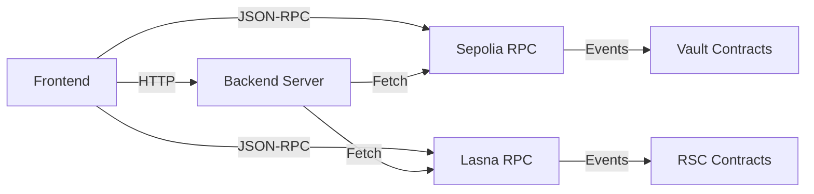

# AmpliFi Frontend User Guide

## Overview

AmpliFi provides a modern, reactive web interface for interacting with the yield optimization system. The frontend consists of multiple specialized pages for different functionality areas.

## Dashboard


**Location:** [index.html](../frontend/index.html)

The main dashboard provides:
- **Total TVL**: Aggregate value locked across all assets ($11,419.77)
- **Best APY**: Highest performing asset with current yield rate
- **Asset Overview**: Real-time performance metrics for all supported tokens
- **Multi-Asset Vault Status**: WETH, LINK, AAVE, EURS, WBTC allocations and APYs
- **RSC Gas Tank**: Monitoring of reactive contract funding levels

### Key Features
- Live price feeds from Chainlink aggregators
- Real-time APY calculations from Aave V3 mainnet
- Automatic refresh every 30 seconds
- Wallet connection with MetaMask

## Multi-Asset Vault


**Location:** [multiasset.html](../frontend/multiasset.html)

### Features
- **Deposit/Withdraw**: Direct interaction with vault contracts
- **Asset Allocation**: Visual representation of current portfolio distribution
- **Individual Asset Tracking**: Per-token balance, APY, and allocation percentage
- **Snapshot History**: Historical rebalancing data with timestamps
- **Live Mainnet Data**: APYs fetched directly from Aave V3 mainnet marked with 🌐

### Asset Details


Each asset card displays:
- Current APY (live from Aave V3)
- Vault balance
- Allocation percentage
- Mainnet data indicator

## Oracle Management


**Location:** [oracle.html](../frontend/oracle.html)

### Price Feeds

The oracle page manages cross-chain price feeds using V2 Reactive Smart Contracts:

| Asset | V2 RSC Address | Source |
|-------|----------------|--------|
| ETH/USD | `0x4217702423754A49AC1e5cc1c1105210bbf7Ba0C` | Chainlink Sepolia Aggregator |
| BTC/USD | `0x4272e8ad2b63c36CC1a9f2CF10aE077478BF55e0` | Chainlink Sepolia Aggregator |
| LINK/USD | `0x4139e3A69bC30d97335a0794983F51c9622FDeBB` | Chainlink Sepolia Aggregator |

### Oracle Status Monitoring


The interface provides:
- **Round ID**: Latest Chainlink round number
- **Current Price**: Real-time asset prices in USD
- **Last Update**: Timestamp of most recent price update
- **RSC Debt Status**: Monitoring of reactive contract gas requirements
- **Health Indicators**: Visual status for each oracle feed

### Debt Management


Each V2 RSC displays:
- Current debt balance (in wei)
- Status indicator (✅ Healthy / ⚠️ Low Balance)
- Real-time monitoring via JSON-RPC calls to Lasna network

## Bridge & Faucet


**Location:** [bridge.html](../frontend/bridge.html)

### Direct Faucet Bridge

The bridge provides seamless conversion from Sepolia ETH to Lasna REACT tokens:

**Conversion Rate:** 100 REACT = 1 ETH

### Features


- **Recipient Selection**: Dropdown menu for all V2 RSCs and wallet address
- **Auto-Conversion**: Automatically converts Sepolia ETH to REACT on Lasna
- **Transaction History**: Real-time monitoring of bridge transactions
- **Balance Display**: Shows current REACT balances for all RSCs

### Supported Recipients


The bridge can fund:
- ETH/USD V2 RSC
- BTC/USD V2 RSC
- LINK/USD V2 RSC
- Your connected wallet (for testing)

### Transaction Flow


1. Select recipient RSC or wallet from dropdown
2. Enter ETH amount (0.1 ETH minimum recommended)
3. Confirm transaction on Sepolia
4. Faucet converts and sends REACT to recipient on Lasna
5. Transaction hash displayed with Blockscout explorer link

## Settings & Configuration


**Location:** [settings.html](../frontend/settings.html)

### Contract Addresses

All deployed contract addresses organized by network:

**Sepolia Contracts:**
- YieldVaultMultiAssetV2
- VaultFeeCollector
- Funder
- Token addresses (WETH, LINK, AAVE, EURS, WBTC)

**Lasna Contracts:**
- YieldOptimizerRsc
- ReactiveFunderRC
- LiquidationProtectorRsc
- V2 Oracle RSCs (ETH, BTC, LINK)

### Network Configuration


- **Chain IDs**: Sepolia (11155111), Lasna (5318007)
- **RPC Endpoints**: Configurable for both networks
- **Block Explorer Links**: Direct navigation to Etherscan/Blockscout

## Technical Details

### Architecture



### Data Flow

1. **Frontend** loads and connects to MetaMask
2. **Backend API** fetches vault data every 10 seconds
3. **RPC Calls** retrieve on-chain state from both networks
4. **Chainlink Events** monitored via V2 RSCs on Lasna
5. **UI Updates** display real-time data with automatic refresh

### API Endpoints

| Endpoint | Method | Description |
|----------|--------|-------------|
| `/api/vault` | GET | Multi-asset vault data (TVL, assets, snapshots) |
| `/api/funder` | GET | Funder contract gas tank balance |
| `/api/prices` | GET | Cross-chain price feed data |
| `/api/health` | GET | Backend health check |

### Browser Compatibility

- **Recommended**: Chrome, Firefox, Brave with MetaMask extension
- **Requirements**: Web3 provider (MetaMask, WalletConnect)
- **Networks**: Must have Sepolia and Lasna networks configured

## Error Handling

### Common Issues

**"Loading prices..." stuck**
- Check MetaMask connection
- Verify network selection (Sepolia)
- Check browser console for JavaScript errors

**"Connect Wallet" not working**
- Install MetaMask extension
- Unlock MetaMask wallet
- Refresh page and try again

**RSC shows "Pending" round ID**
- V2 RSCs need REACT funding on Lasna
- Use bridge to send 0.5 REACT to each RSC
- Wait ~1 minute for Chainlink aggregator event

**Transaction failures**
- Ensure sufficient ETH balance for gas
- Check token approvals before deposits
- Verify contract addresses match deployed versions

## Development Setup

### Local Server

```bash
# Start backend server
cd backend
node server.js

# Server runs on http://localhost:3001
```

### File Structure

```
frontend/
├── index.html          # Dashboard
├── multiasset.html     # Multi-Asset Vault
├── oracle.html         # Oracle Management
├── bridge.html         # Faucet Bridge
├── settings.html       # Configuration
└── js/
    └── app_v2.js      # Core application logic
```

### Configuration

All contract addresses are defined in [app_v2.js](../frontend/js/app_v2.js):

```javascript
CONFIG: {
    VAULT_MULTI_ASSET: "0x42437f29E25Ad65E121f4D0f07FD8F5c2005e5d5",
    FUNDER: "0x0CabFEE932171171d90D672160cC6939f93b2D39",
    // ... additional addresses
}
```

## Security Considerations

- All transactions require MetaMask confirmation
- Private keys never exposed to frontend
- Read-only operations don't require wallet connection
- Contract addresses hardcoded and verified on Etherscan

## Future Enhancements

- [ ] Multi-wallet support (WalletConnect, Coinbase Wallet)
- [ ] Mobile responsive design
- [ ] Advanced charting with historical APY data
- [ ] Gas optimization recommendations
- [ ] Transaction simulation before execution
- [ ] Multi-language support

---

**Last Updated:** January 7, 2026

**Contract Versions:** V2 (EURS Fixed, V2 RSCs with Aggregator subscriptions)

**Network Status:** ✅ All systems operational
