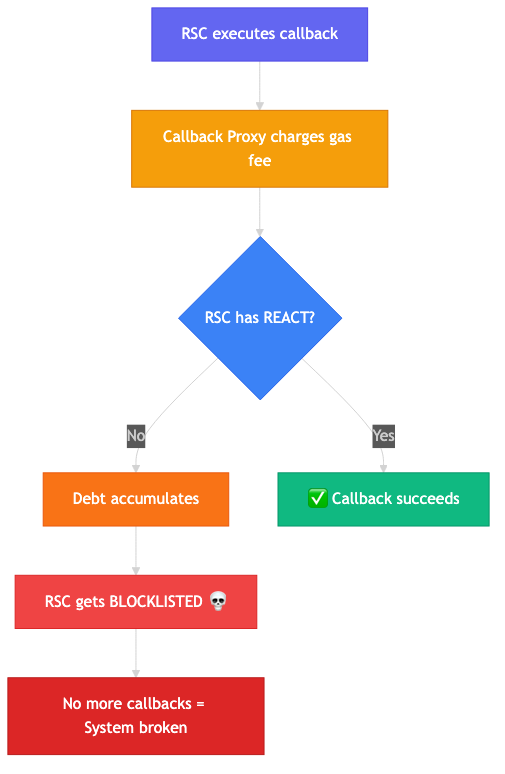

# RSC Debt Management & Auto-Clearing

## Overview

Reactive Smart Contracts (RSCs) on the Reactive Network (Lasna) accumulate **debt** when they execute callbacks without sufficient REACT token balance. If debt accumulates too much, the RSC becomes blocklisted and stops functioning.

This document describes the comprehensive debt management solution implemented for the Yield Optimizer.

## The Problem



## Solution Components


### 1. Frontend Debt Clearing (User-Initiated)

**Location**: [oracle.html](../frontend/oracle.html) and [bridge.html](../frontend/bridge.html)

**Features**:
- Real-time RSC debt monitoring
- Individual "Clear Debt" buttons for each RSC
- "Clear All Debt" button for batch clearing
- Auto-Clear toggle for periodic debt clearing
- Fund RSC buttons to send REACT directly

**How it works**:
1. User connects MetaMask
2. User switches to Lasna network (automatic prompt)
3. User clicks "Clear Debt" 
4. Frontend calls `coverDebt()` on the RSC
5. RSC uses its REACT balance to pay off debt

**Code Flow**:
```javascript
// oracle.html - clearDebt function
async function clearDebt(rscAddress, symbol) {
    // 1. Connect wallet
    // 2. Switch to Lasna
    // 3. Create contract instance
    const rscContract = new ethers.Contract(rscAddress, ['function coverDebt() external'], signer);
    // 4. Call coverDebt()
    const tx = await rscContract.coverDebt();
    await tx.wait();
}
```

### 2. DebtClearerRSC (Automated On-Chain)

**Location**: [src/autoreplenish/DebtClearerRSC.sol](../src/autoreplenish/DebtClearerRSC.sol)

**Features**:
- Automated debt monitoring via cron
- Batch RSC registration
- Configurable debt thresholds
- Statistics tracking
- Manual trigger capability

**How it works**:
1. Owner registers RSCs to monitor
2. DebtClearerRSC periodically checks debt via `react()` function
3. When debt > threshold AND balance > debt, it emits a Callback
4. Callback executes `coverDebt()` on the target RSC
5. Debt is cleared automatically

**Contract Interface**:
```solidity
contract DebtClearerRSC {
    // Register RSCs
    function registerRsc(address rsc, string memory name) external;
    function registerRscBatch(address[] calldata rscs, string[] calldata names) external;
    
    // Manual operations
    function manualClearDebt(address rsc) external;
    function clearAllDebts() external;
    
    // View functions
    function getAllDebtStatus() external view returns (
        address[] memory rscs,
        uint256[] memory debts,
        uint256[] memory balances,
        bool[] memory canClear
    );
}
```

### 3. Existing Auto-Refill System

**Contracts**:
- `ReactiveFunderRC.sol` - Monitors and refills RSC balance
- `OracleAutoFunder.sol` - Specific to Oracle Mirror RSCs
- `Funder.sol` - Collects fees and bridges funds

**Flow**:
```
User pays fee → Funder receives ETH → FundsReceived event
                        ↓
ReactiveFunderRC detects event → Checks RSC balance
                        ↓
Balance low? → Emit Callback to bridgeToFaucet()
                        ↓
Faucet converts SepETH → REACT (100:1 ratio)
                        ↓
RSC receives REACT → Can cover debt + execute callbacks
```

## User Guide

### Clearing Debt via Frontend

1. **Navigate to Oracle or Bridge page**
   - Oracle: `oracle.html` - RSC Monitoring section
   - Bridge: `bridge.html` - RSC Debt Management section

2. **Connect Wallet**
   - Click "Connect Wallet" in the header
   - Approve connection in MetaMask

3. **Check RSC Status**
   - View debt amount for each RSC
   - Green = Healthy (no debt)
   - Yellow = Has debt but can clear
   - Red = Has debt, needs funds first

4. **Clear Individual Debt**
   - Click "Clear Debt" button on an RSC card
   - MetaMask will prompt to switch to Lasna
   - Confirm transaction
   - Wait for confirmation

5. **Clear All Debts**
   - Click "Clear All Debt" button
   - Will process all RSCs with debt sequentially
   - Toast notifications show progress

6. **Enable Auto-Clear (Optional)**
   - Click "Auto-Clear" toggle
   - System will check every 5 minutes
   - Automatically clears debt when RSC has balance

### Funding RSCs

If an RSC has debt but insufficient balance:

1. **Via Direct Faucet Bridge**
   - Go to Bridge page
   - Select RSC from dropdown
   - Enter ETH amount (0.1 ETH = 10 REACT)
   - Click "Convert to REACT"

2. **Via Fund Button**
   - Click "Fund" button on RSC card
   - Sends 0.1 ETH (10 REACT) to the RSC

## Deployed Contracts

### Oracle Mirror RSCs (Lasna)
| Asset | Address |
|-------|---------|
| ETH Mirror | `0x1CdD260983f23c2A29a91134442C499cd3cc29cF` |
| BTC Mirror | `0xa17c0a6abac640ee401ff767efa1cbf31966a848` |
| LINK Mirror | `0xdb0a8ab7ea10f2d9e1be242718699bee43131274` |

### Supporting Contracts
| Contract | Chain | Address |
|----------|-------|---------|
| DebtClearerRSC | Lasna | `0x1d05f01377376d1cFa4b6A9da19B83135949F63C` |
| Funder | Sepolia | `0x0CabFEE932171171d90D672160cC6939f93b2D39` |
| ReactiveFunderRC | Lasna | `0x1caC802c52Cd82b9988e1163aF46258539280E71` |
| YieldOptimizerRSC | Lasna | `0x98969559717c24b47A2E4365a569c947a88C4767` |

## Technical Details

### coverDebt() Function

From `AbstractPayer.sol`:
```solidity
function coverDebt() external {
    uint256 amount = vendor.debt(address(this));
    _pay(payable(vendor), amount);
}
```

- Gets debt amount from system contract
- Pays the vendor (system contract) to clear debt
- Requires RSC balance >= debt amount

### System Contract (Lasna)

Address: `0x0000000000000000000000000000000000fffFfF`

Methods:
- `debt(address rsc) returns (uint256)` - Get RSC debt
- Payments to this address settle debt

### Network Details

**Lasna Testnet**:
- Chain ID: 5318007 (0x512417)
- RPC: https://lasna-rpc.rnk.dev
- Native Token: REACT
- Explorer: https://reactscan.net

## Deployment

### Deploy DebtClearerRSC

```bash
# Set environment
export PRIVATE_KEY="your-private-key"

# Deploy to Lasna
forge script script/DeployDebtClearer.s.sol \
    --rpc-url https://lasna-rpc.rnk.dev \
    --broadcast -vvvv
```

### Post-Deployment

1. Fund the DebtClearerRSC with REACT
2. Call `subscribeToCron()` to enable periodic checks
3. Register additional RSCs if needed

## Troubleshooting

### "Insufficient funds" Error
- The RSC doesn't have enough REACT to cover debt
- Fund the RSC first via faucet bridge

### "Network changed" Error
- MetaMask switched networks during transaction
- Reload the page and try again

### RSC Still Shows Debt After Clearing
- Wait a few seconds for the transaction to confirm
- Click "Refresh" to update status

### Can't Switch to Lasna
- Make sure MetaMask is updated
- Add Lasna manually using network details above

## Related Documentation

- [Architecture Overview](ARCHITECTURE.md)
- [True Auto-Replenishment](TRUE_AUTO_REPLENISHMENT.md)
- [Reactive Network Docs](https://dev.reactive.network/)
- [Reactivate Pattern](https://blog.reactive.network/reactivate-automated-monitoring-and-funding-for-reactive-contracts/)
