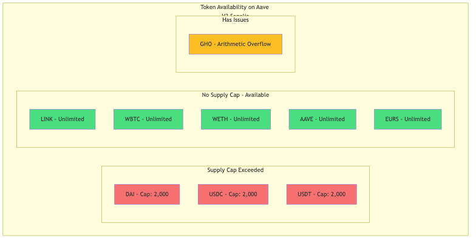
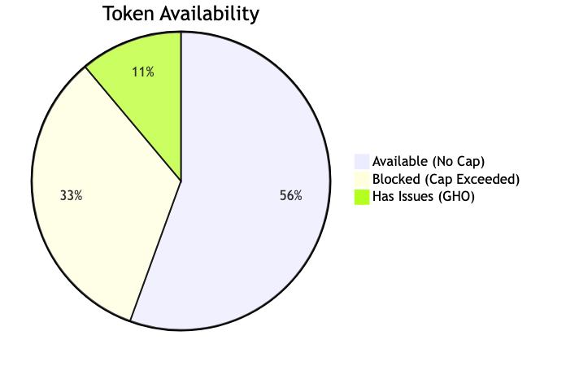
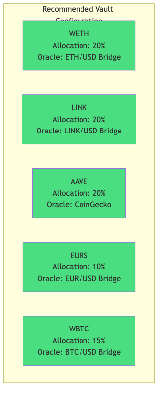
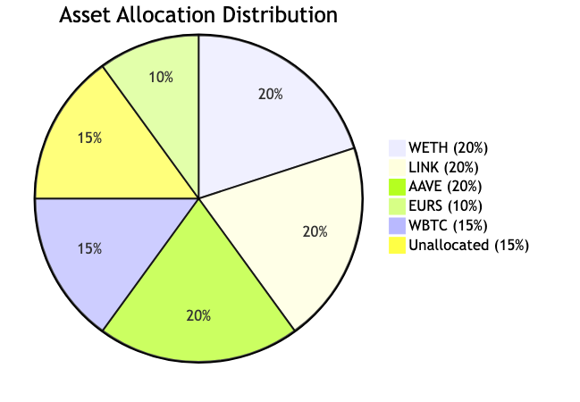

# Token Research and USDT Replacement Analysis

## Overview

This document provides comprehensive research on finding a suitable replacement for USDT in the YieldOpt Multi-Asset Vault, following the discovery that USDT deposits fail due to Aave V3 Sepolia supply cap limits.

---

## Problem Statement

USDT (Tether) deposits to the vault fail with Aave Error Code 51 (Supply cap exceeded).

| Metric | Value |
|--------|-------|
| Supply Cap | 2,000 USDT |
| Current Supply | 2.788 billion USDT |
| Over Cap By | 1,394,000x |

---

## Research: Available Tokens on Aave V3 Sepolia

### Token Availability Overview

### Availability Summary

### Token Addresses

| Token | Address | Decimals | Status |
|-------|---------|----------|--------|
| DAI | 0xFF34B3d4Aee8ddCd6F9AFFFB6Fe49bD371b8a357 | 18 | Blocked |
| LINK | 0xf8Fb3713D459D7C1018BD0A49D19b4C44290EBE5 | 18 | Available |
| USDC | 0x94a9D9AC8a22534E3FaCa9F4e7F2E2cf85d5E4C8 | 6 | Blocked |
| WBTC | 0x29f2D40B0605204364af54EC677bD022dA425d03 | 8 | Available |
| WETH | 0xC558DBdd856501FCd9aaF1E62eae57A9F0629a3c | 18 | Available |
| USDT | 0xaA8E23Fb1079EA71e0a56F48a2aA51851D8433D0 | 6 | Blocked |
| AAVE | 0x88541670E55cC00bEEFD87eB59EDd1b7C511AC9a | 18 | Available |
| EURS | 0x6d906e526a4e2Ca02097BA9d0caA3c382F52278E | 2 | Available |
| GHO | 0xc4bF5CbDaBE595361438F8c6a187bDc330539c60 | 18 | Has Issues |

---

## Key Findings

1. All USD-pegged stablecoins (USDT, USDC, DAI) have supply caps of 2,000 tokens - ALL exceeded
2. Non-stablecoin assets (WETH, LINK, AAVE, WBTC) have NO supply caps - all work perfectly
3. EURS (Euro stablecoin) has no supply cap and works perfectly
4. GHO (Aave native stablecoin) has no supply cap but has arithmetic overflow issues

---

## Chainlink Price Feed Availability

### Base Sepolia Source Chain

| Feed | Proxy Address | Status |
|------|---------------|--------|
| ETH/USD | 0x4aDC67696bA383F43DD60A9e78F2C97Fbbfc7cb1 | Active |
| BTC/USD | 0x0FB99723Aee6f420beAD13e6bBB79b7E6F034298 | Active |
| LINK/USD | 0xb113F5A928BCfF189C998ab20d753a47F9dE5A61 | Active |
| USDC/USD | 0xf3138B59cAcbA1a4d7d24fA7b184c20B3941433e | Active |
| DAI/USD | - | Not Deployed |
| AAVE/USD | - | Not Available |

---

## Recommended Solution

### Option 1: Keep Current 5-Asset Configuration (RECOMMENDED)

**Rationale:**
- All 5 assets have NO supply caps on Aave Sepolia
- All 5 have working oracle price feeds (4 via bridge, 1 via CoinGecko)
- Provides diverse asset exposure: Major cryptos (WETH, WBTC, LINK), governance (AAVE), and fiat-pegged (EURS)
- EURS serves as the stablecoin exposure (Euro-pegged)

### Alternative Options

| Option | Description | Status |
|--------|-------------|--------|
| Option 1 | Keep 5 Assets | RECOMMENDED |
| Option 2 | Deploy Custom Token | NOT RECOMMENDED |
| Option 3 | Wait for Cap Reset | UNCERTAIN |

---

## Current Implementation Status

### Asset Allocations

### Vault Configuration

| Parameter | Value |
|-----------|-------|
| Total Allocation | 8500 BPS (85%) |
| Remaining | 1500 BPS (15%) |
| Assets | 5 |

### Current Balances

| Asset | Balance |
|-------|---------|
| WETH | 0.1 ETH |
| LINK | 21.36 LINK |
| AAVE | 1.0 AAVE |
| EURS | 5001.98 EURS |
| WBTC | 0.06 WBTC |

---

## Oracle Bridges (Reactive Network)

| Feed | Lasna Contract | Status |
|------|---------------|--------|
| ETH/USD | 0x1CdD260983f23c2A29a91134442C499cd3cc29cF | Active |
| BTC/USD | 0xa17c0a6abac640ee401ff767efa1cbf31966a848 | Active |
| LINK/USD | 0xdb0a8ab7ea10f2d9e1be242718699bee43131274 | Active |
| USDC/USD | 0x188c7b7dC3EEbCA58371abC8D62cB62bEE201d47 | Active |
| EUR/USD | 0x8BAA1e0E5d8b686eB5b5E0F46346171fd1c79431 | Active |

---

## Conclusion

The current 5-asset vault configuration is optimal for the Aave V3 Sepolia testnet environment.

**Summary:**
- All assets work with unlimited supply caps
- Diverse asset coverage (crypto majors, governance, stablecoin)
- Working oracle bridges via Reactive Network
- Active yield generation via Aave V3

No replacement for USDT needed because EURS provides stablecoin exposure.

---

## Technical Notes

### Error Codes Reference

| Code | Meaning | Affected Assets |
|------|---------|----------------|
| 51 | Supply cap exceeded | USDT, USDC, DAI |
| 27 | Reserve frozen | None currently |
| 28 | Reserve inactive | None currently |

### Contract Addresses (Sepolia)

| Contract | Address |
|----------|---------|
| Vault | 0x9015fb507E9bE03fB59514ba7a913122e5Fa2e7d |
| Aave Pool | 0x6Ae43d3271ff6888e7Fc43Fd7321a503ff738951 |
| Aave Faucet | 0xC959483DBa39aa9E78757139af0e9a2EDEb3f42D |

---

*Last Updated: December 27, 2024*
*Research conducted for Reactive Yield Optimizer Project*
