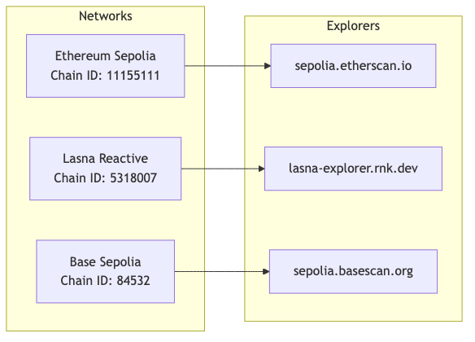
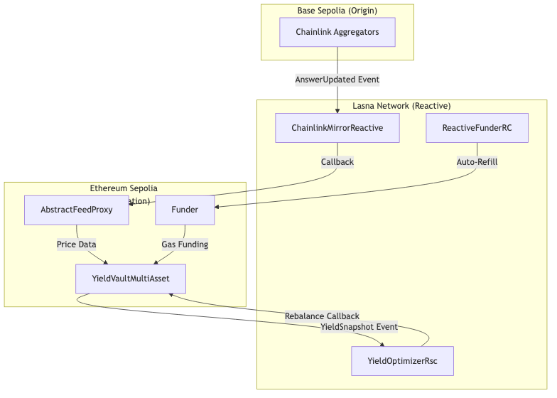
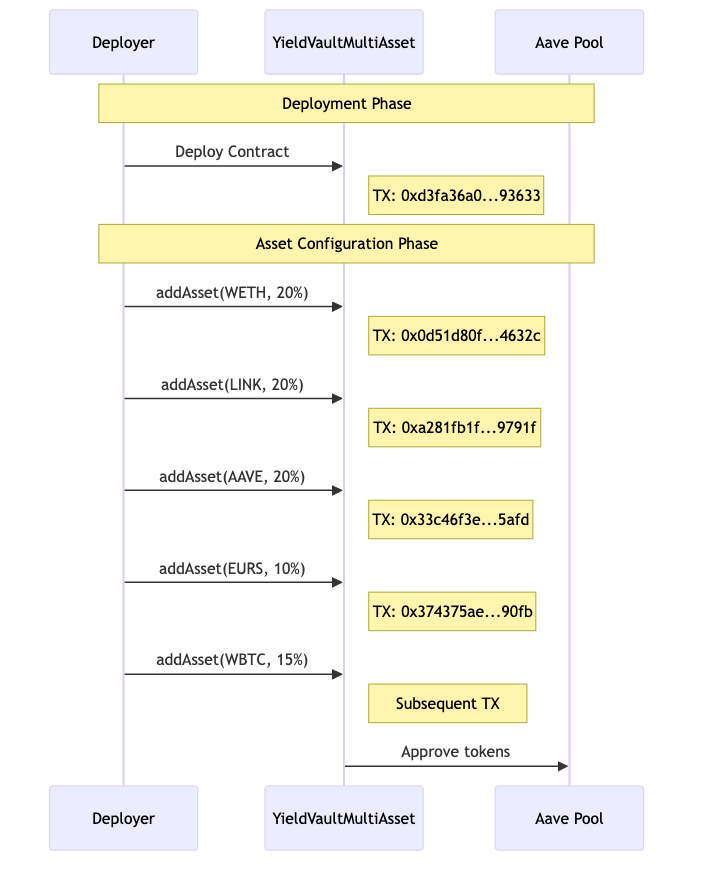
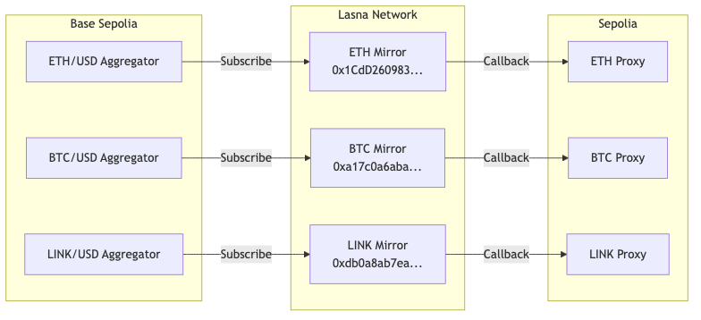
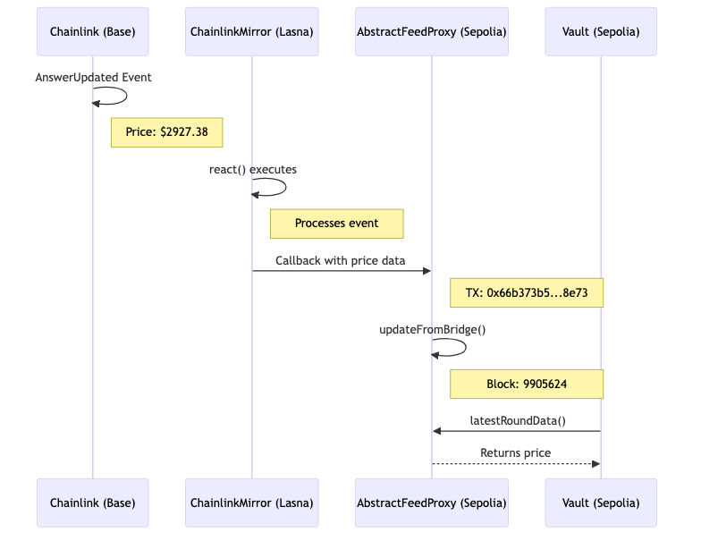
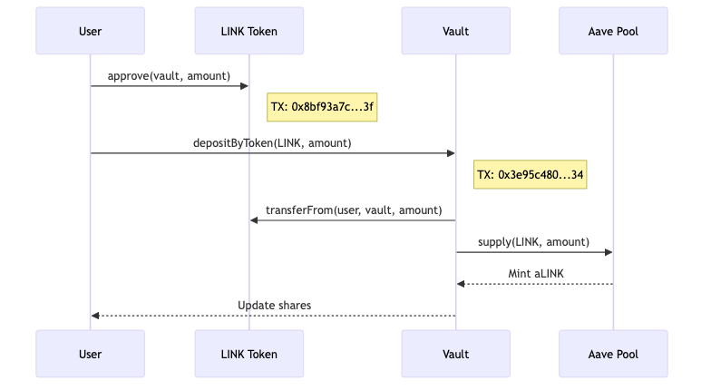
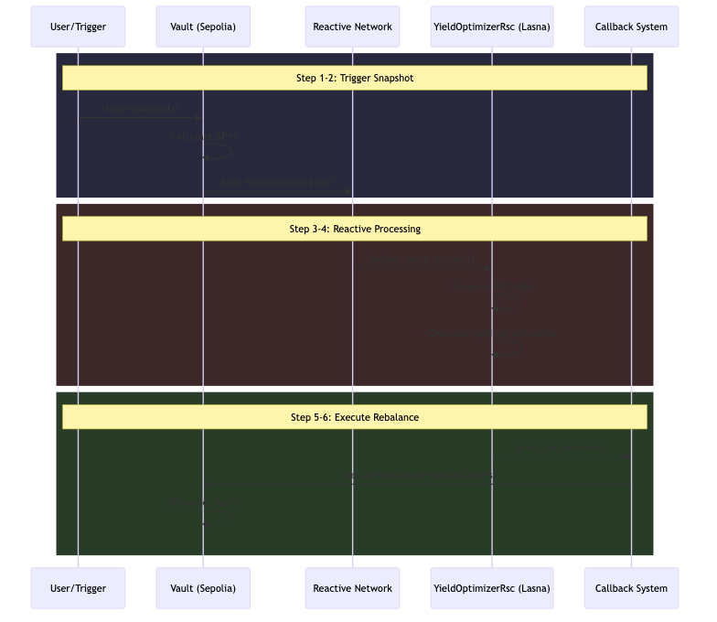
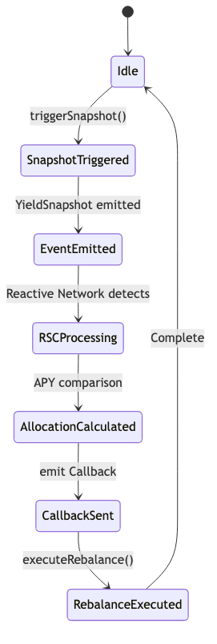

# Workflow Transactions

This document contains all transaction hashes for every step of the YieldOpt deployment and operation workflow. All transactions are verifiable on their respective block explorers.

---

## Network Information

| Network | Chain ID | Explorer |
|---------|----------|----------|
| Ethereum Sepolia | 11155111 | https://sepolia.etherscan.io |
| Lasna (Reactive) | 5318007 | https://lasna-explorer.rnk.dev |
| Base Sepolia | 84532 | https://sepolia.basescan.org |

---

## Complete System Architecture

The system spans three networks:
- **Base Sepolia**: Origin chain for Chainlink price feeds
- **Lasna Network**: Reactive layer for event processing
- **Ethereum Sepolia**: Destination chain for vault operations

---

## Phase 1: Destination Contract Deployment (Sepolia)

### YieldVaultMultiAsset Deployment Flow

### Deployment Transactions

| Step | Transaction Hash | Description |
|------|------------------|-------------|
| Deploy Vault | `0xd3fa36a0be2950537c0271937c4448c1256e6030f822b3e021f4724aa9093633` | Deploy YieldVaultMultiAsset contract |
| Add WETH Asset | `0x0d51d80fd8b2373521ec02967c4f2f4586c52322b4172dbccdacecd7e0b4632c` | Add WETH (ID: 1) with 20% allocation |
| Add LINK Asset | `0xa281fb1f1b6b27ba33a773730079a6c6bda91fba3a35e528b0698746f9e9791f` | Add LINK (ID: 2) with 20% allocation |
| Add AAVE Asset | `0x33c46f3ee3e70bf4e3b26a71a41f89c343ad39be314145c9e30e072ccb9d5afd` | Add AAVE (ID: 3) with 20% allocation |
| Add EURS Asset | `0x374375ae3b127af75a3d29aa7294cd55fd7093869450c345ee4cc2d7eae490fb` | Add EURS (ID: 4) with 10% allocation |

**Contract Address:** `0x9015fb507E9bE03fB59514ba7a913122e5Fa2e7d`

### AbstractFeedProxy Deployments (Oracle Bridges)

| Feed | Transaction Hash | Contract Address |
|------|------------------|------------------|
| LINK/USD | `0xc72b159f13f329b26f3b2ec7b6816cbbd1ee54627d907f2de81d2efcd84e6547` | `0x6B94668442B97e7dCF1958044a21e42a73D3647b` |
| ETH/USD | Deployed via factory | `0xb1aDCca598051EfdaD48217D950EAFf2CA869691` |
| BTC/USD | Deployed via factory | `0x736D13De4d6BF46DC81f89a759D6e3C2FbC9D6b9` |
| USDC/USD | Deployed via factory | `0xdE87eC23198867B298E74d1a2c902Aa02381b6d8` |
| EUR/USD | Deployed via factory | `0x955e94A600d059789d42ca533fe90c5187f520Af` |

---

## Phase 2: Reactive Contract Deployment (Lasna)

### ChainlinkMirrorReactive Architecture

### RSC Deployment Transactions

| Contract | Transaction Hash | Address |
|----------|------------------|---------|
| LINK Mirror | `0x5715ac116f9069f1bc8fefd1c62befc64b7bed70a842a96c9672b208e94ef318` | `0xdb0a8ab7ea10f2d9e1be242718699bee43131274` |
| ETH Mirror | Deployed separately | `0x1CdD260983f23c2A29a91134442C499cd3cc29cF` |
| BTC Mirror | Deployed separately | `0xa17c0a6abac640ee401ff767efa1cbf31966a848` |

### YieldOptimizerRsc Deployment

| Step | Transaction Hash | Description |
|------|------------------|-------------|
| Deploy RSC | `0x239681bf8e7080d80bb4d5e60ab268f2e71d529e9fa617acecb0ad09b647ea2c` | Deploy YieldOptimizerRsc with subscription |

**Contract Address:** `0x98969559717c24b47A2E4365a569c947a88C4767`

---

## Phase 3: RSC Subscription Configuration

### Subscription Details

| Parameter | Value |
|-----------|-------|
| Origin Chain | 11155111 (Sepolia) |
| Destination Chain | 11155111 (Sepolia) |
| Origin Contract | 0x9015fb507E9bE03fB59514ba7a913122e5Fa2e7d |
| Event | YieldSnapshot(uint256,uint256[],uint256[],uint256[],uint256,uint256) |

---

## Phase 4: Operational Transactions

### Cross-Chain Oracle Update Flow

### Oracle Bridge Update Transactions

| Feed | Update Transaction | Block | Network |
|------|-------------------|-------|---------|
| ETH/USD | `0x66b373b51e8e70d320a507252d50bad1f1bc185f3d06d5beada1d5202d0e8e73` | 9905624 | Sepolia |

### User Deposit Flow

### User Deposit Transactions

| Step | Transaction Hash | Description |
|------|------------------|-------------|
| LINK Approval | `0x8bf93a7ca49efb1b4ab4b26e3d2dd5db565ec397d2610cea1750210a23121c3f` | Approve vault to spend LINK |
| LINK Deposit | `0x3e95c4809d93d190970a3c59aab294eeb29dbdf3da6157e653c1e9ff1837d634` | Deposit 1 LINK to vault |

### USDT Removal (Supply Cap Issue Mitigation)

| Step | Transaction Hash | Description |
|------|------------------|-------------|
| Remove USDT | `0xd21847660df6d9517b1e3f4cfcff4b295ee28219d869924c8158dd4fd322473e` | Remove asset ID 6 due to Aave supply cap exceeded |

---

## Phase 5: Yield Snapshot and Rebalancing Flow

### Complete Rebalancing Workflow

### State Transitions

### Workflow Steps

| Step | Network | Description |
|------|---------|-------------|
| 1 | Sepolia | User calls triggerSnapshot() on Vault |
| 2 | Sepolia | YieldSnapshot event emitted |
| 3 | Lasna | Reactive Network detects event |
| 4 | Lasna | YieldOptimizerRsc.react() executes |
| 5 | Lasna | RSC emits Callback event |
| 6 | Sepolia | executeRebalance() called on Vault |

---

## Verification Links

### Sepolia Etherscan

| Contract | Link |
|----------|------|
| Vault | https://sepolia.etherscan.io/address/0x9015fb507E9bE03fB59514ba7a913122e5Fa2e7d |
| ETH Proxy | https://sepolia.etherscan.io/address/0xb1aDCca598051EfdaD48217D950EAFf2CA869691 |
| BTC Proxy | https://sepolia.etherscan.io/address/0x736D13De4d6BF46DC81f89a759D6e3C2FbC9D6b9 |
| LINK Proxy | https://sepolia.etherscan.io/address/0x6B94668442B97e7dCF1958044a21e42a73D3647b |

### Lasna ReactScan

| Contract | Link |
|----------|------|
| YieldOptimizerRsc | https://lasna-explorer.rnk.dev/address/0x98969559717c24b47A2E4365a569c947a88C4767 |
| ETH Mirror | https://lasna-explorer.rnk.dev/address/0x1CdD260983f23c2A29a91134442C499cd3cc29cF |
| BTC Mirror | https://lasna-explorer.rnk.dev/address/0xa17c0a6abac640ee401ff767efa1cbf31966a848 |
| LINK Mirror | https://lasna-explorer.rnk.dev/address/0xdb0a8ab7ea10f2d9e1be242718699bee43131274 |

---

## Summary Statistics

| Metric | Count |
|--------|-------|
| Total Deployment Transactions | 15+ |
| Contracts on Sepolia | 8 |
| Contracts on Lasna | 4 |
| Cross-Chain Bridges | 5 |
| Supported Assets | 5 |

---

## Transaction Hash Reference

### Deployment Transactions

| Category | Transaction Hash | Network |
|----------|------------------|---------|
| Vault Deploy | `0xd3fa36a0be2950537c0271937c4448c1256e6030f822b3e021f4724aa9093633` | Sepolia |
| Add WETH | `0x0d51d80fd8b2373521ec02967c4f2f4586c52322b4172dbccdacecd7e0b4632c` | Sepolia |
| Add LINK | `0xa281fb1f1b6b27ba33a773730079a6c6bda91fba3a35e528b0698746f9e9791f` | Sepolia |
| Add AAVE | `0x33c46f3ee3e70bf4e3b26a71a41f89c343ad39be314145c9e30e072ccb9d5afd` | Sepolia |
| Add EURS | `0x374375ae3b127af75a3d29aa7294cd55fd7093869450c345ee4cc2d7eae490fb` | Sepolia |
| LINK Proxy Deploy | `0xc72b159f13f329b26f3b2ec7b6816cbbd1ee54627d907f2de81d2efcd84e6547` | Sepolia |
| LINK Mirror Deploy | `0x5715ac116f9069f1bc8fefd1c62befc64b7bed70a842a96c9672b208e94ef318` | Lasna |
| RSC Deploy | `0x239681bf8e7080d80bb4d5e60ab268f2e71d529e9fa617acecb0ad09b647ea2c` | Lasna |

### Operational Transactions

| Category | Transaction Hash | Network | Block |
|----------|------------------|---------|-------|
| ETH Bridge Update | `0x66b373b51e8e70d320a507252d50bad1f1bc185f3d06d5beada1d5202d0e8e73` | Sepolia | 9905624 |
| LINK Approval | `0x8bf93a7ca49efb1b4ab4b26e3d2dd5db565ec397d2610cea1750210a23121c3f` | Sepolia | 9918658 |
| LINK Deposit | `0x3e95c4809d93d190970a3c59aab294eeb29dbdf3da6157e653c1e9ff1837d634` | Sepolia | 9917636 |
| Remove USDT | `0xd21847660df6d9517b1e3f4cfcff4b295ee28219d869924c8158dd4fd322473e` | Sepolia | - |

---

*Document generated: December 27, 2024*
*All transactions verified on respective block explorers*
