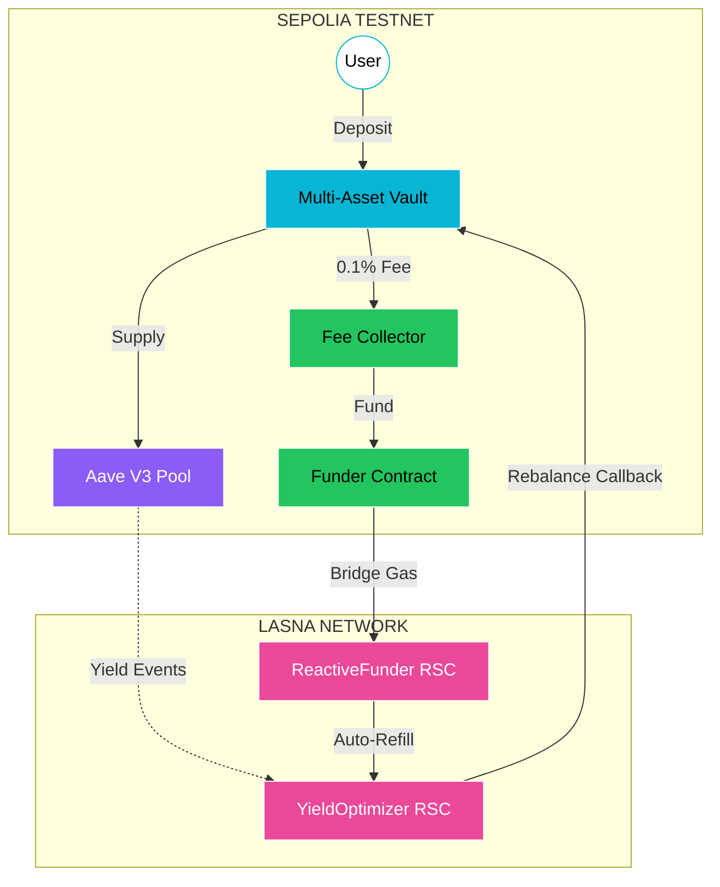
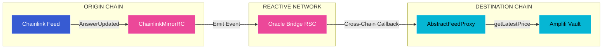
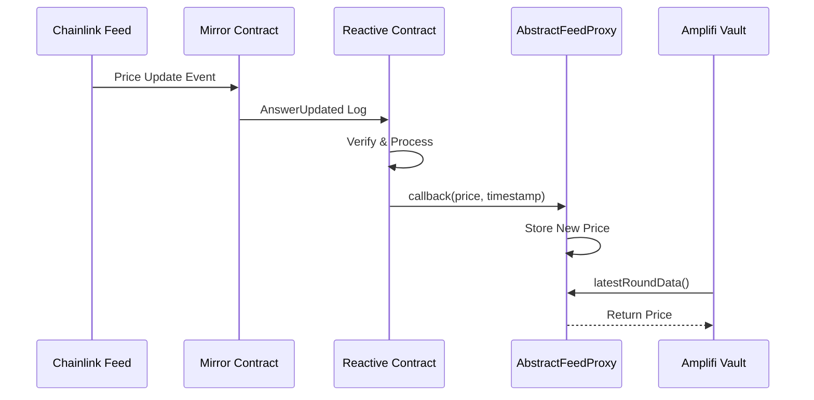
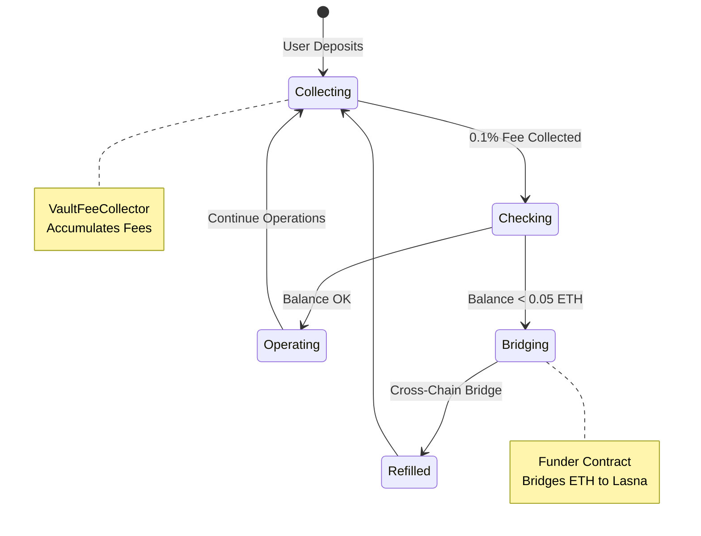
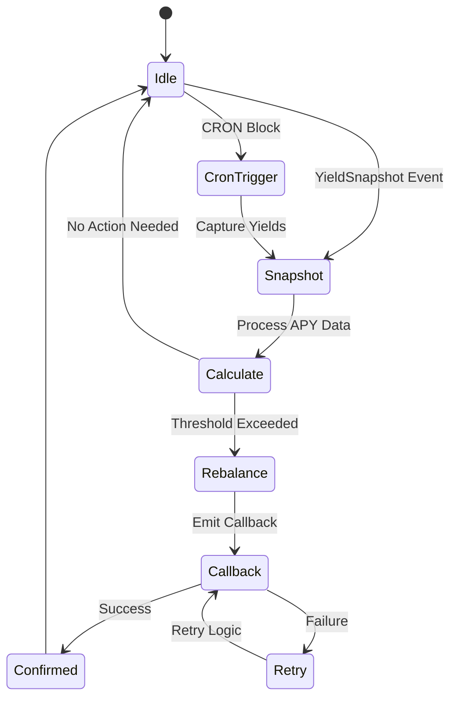

# AMPLIFI

## REACTIVE YIELD OPTIMIZER

CROSS-CHAIN | AUTONOMOUS | REACTIVE

  

    
    Sepolia
  

  

    
    Lasna
  

  
    POWERED BY REACTIVE NETWORK
  

---

# THE PROBLEM

  <h3 class="text-cyan-400 text-lg mb-3">Manual Monitoring</h3>
  

    Users must constantly check APY rates across protocols and chains manually.
  

  <h3 class="text-cyan-400 text-lg mb-3">Centralized Keepers</h3>
  

    Reliance on AWS Lambda or cron jobs introduces single points of failure.
  

  <h3 class="text-cyan-400 text-lg mb-3">Cross-Chain Friction</h3>
  

    Synchronizing state and triggers across networks is complex and error-prone.
  

  <h3 class="text-cyan-400 text-lg mb-3">Gas Inefficiency</h3>
  

    Triggering rebalances requires sophisticated, costly off-chain logic.
  

---
layout: two-cols
---

# PARADIGM SHIFT

::left::

  <h3 class="text-red-400 text-xl mb-4">TRADITIONAL</h3>
  

    

      Off-chain Infrastructure
    

    

      Trusted Keepers Required
    

    

      High Latency Operations
    

    

      Manual Gas Management
    

  

::right::

  <h3 class="text-green-400 text-xl mb-4">REACTIVE</h3>
  

    

      100% On-Chain Logic
    

    

      Trustless Automation
    

    

      Event-Driven Execution
    

    

      Self-Sustaining Gas
    

  

---

# SYSTEM ARCHITECTURE

---

# CORE DASHBOARD

  

  Live Dashboard | Real-time Yield Data | Wallet Integration

---

# DEPLOYED CONTRACTS

  <h3 class="text-cyan-400 mb-4">Sepolia Testnet</h3>
  

    

      YieldVaultMultiAssetV2
      <code class="text-cyan-400">0x4243...e5d5</code>
    

    

      VaultFeeCollector
      <code class="text-purple-400">0x3777...33Cf</code>
    

    

      Funder
      <code class="text-blue-400">0x0Cab...2D39</code>
    

    

      MultiFeedDestination
      <code class="text-green-400">0x889c...b3F3</code>
    

  

  

    <a href="https://sepolia.etherscan.io/address/0x42437f29E25Ad65E121f4D0f07FD8F5c2005e5d5" class="text-cyan-400 hover:text-cyan-300 text-sm">VIEW ON ETHERSCAN >></a>
  

  <h3 class="text-pink-400 mb-4">Lasna Network</h3>
  

    

      YieldOptimizerRsc
      Event Monitor
    

    

      ReactiveFunderRC
      Auto-Refill
    

    

      CRONReactiveContract
      Scheduler
    

    

      ChainlinkMirrorRC
      Oracle Bridge
    

  

  

    <a href="https://lasna.reactscan.net/" class="text-pink-400 hover:text-pink-300 text-sm">VIEW ON REACTSCAN >></a>
  

---

# MULTI-ASSET SUPPORT

  
  
WETH

  
25%

  
  
LINK

  
20%

  
  
AAVE

  
20%

  
  
EURS

  
15%

  
  
WBTC

  
20%

  All assets deposited into Aave V3 Sepolia for yield generation

---

# CROSS-CHAIN ORACLE

  
ETH/USD

  
LINK/USD

  
BTC/USD

  
EUR/USD

---

# ORACLE BRIDGE SEQUENCE

---

# MULTI-ASSET VAULT UI

  

  
Glassmorphism

  
Real-time Data

  
Wallet Connect

  
Tx Tracking

---

# AUTO-REPLENISHMENT

  <h3 class="text-green-400 text-center">Self-Sustaining Gas Model</h3>
  
System never runs out of gas - fees fund automation

---

# RSC STATE MACHINE

---

# ON-CHAIN VALIDATION

  

    
    
SEPOLIA - VAULT CONTRACT

  

  

    
    
LASNA - RSC CONTRACT

  

---

# ORACLE PAGE

  

  Live Cross-Chain Price Feeds | Powered by Chainlink + Reactive Network

---

# FUTURE ROADMAP

  
PHASE 1

  <h3 class="text-purple-400 mt-4 mb-3">L2 Scaling</h3>
  

    Deploying vaults to Arbitrum and Optimism for lower fees and faster finality.
  

  
PHASE 2

  <h3 class="text-cyan-400 mt-4 mb-3">AI Strategy</h3>
  

    Integrating ML models for predictive yield optimization and risk management.
  

  
PHASE 3

  <h3 class="text-pink-400 mt-4 mb-3">Insurance</h3>
  

    On-chain risk coverage for protocol failures and smart contract exploits.
  

---
layout: center
class: text-center
---

# AMPLIFI

Cross-Chain Yield Optimization

  <a href="https://github.com/guglxni/amplifi" class="cyber-card px-8 py-4 hover:border-cyan-500/50">
    GITHUB
  </a>
  <a href="https://reactive.network" class="cyber-card px-8 py-4 border-purple-500/50 hover:border-purple-500">
    REACTIVE
  </a>
  <a href="https://dorahacks.io/hackathon/reactive-bounties-2" class="cyber-card px-8 py-4 hover:border-pink-500/50">
    DORAHACKS
  </a>

  BUILT FOR REACTIVE NETWORK BOUNTY SPRINT

