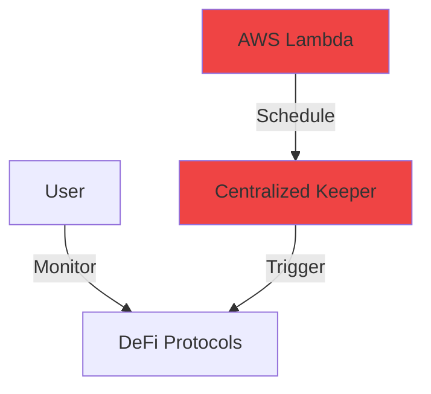
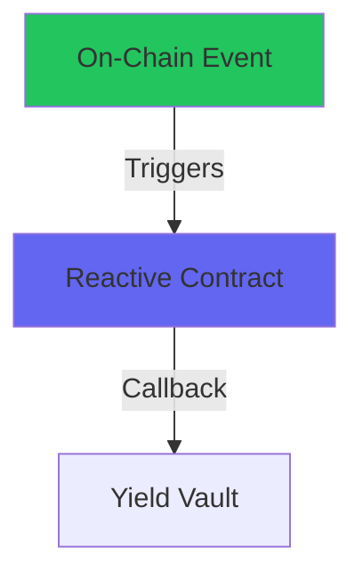
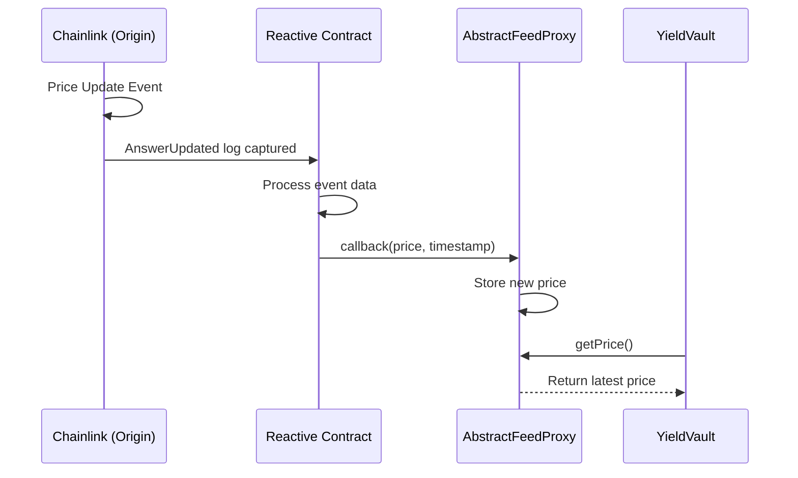
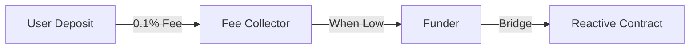

# Amplifi

## Reactive Yield Optimizer

*Cross-Chain Yield Optimization using Reactive Smart Contracts*

<div class="pt-12">
  <span class="px-2 py-1 rounded" style="background: linear-gradient(135deg, #6366f1, #a855f7); color: white;">
    Powered by Reactive Network
  </span>
</div>

<div class="abs-br m-6 flex gap-2">
  <a href="https://github.com/guglxni" target="_blank" class="text-xl slidev-icon-btn">
    <carbon-logo-github />
  </a>
</div>

---
layout: intro
---

# The Problem

<v-clicks>

## Traditional Yield Optimization Challenges

- **Manual Monitoring Required** - Users must constantly check APY rates across protocols
- **Centralized Keepers** - Most solutions rely on AWS Lambda, cron jobs (single points of failure)
- **Cross-Chain Coordination** - Synchronizing state across networks is complex
- **Gas Cost Optimization** - Triggering rebalances requires sophisticated off-chain logic
- **Trust Assumptions** - Relying on third-party infrastructure for automation

</v-clicks>

---
layout: two-cols
---

# Traditional vs Reactive

::left::

## Traditional Approach ❌



- Off-chain infrastructure required
- Single points of failure
- Trust assumptions
- Operational overhead

::right::

## Reactive Approach ✅



- 100% on-chain automation
- Trustless execution
- Event-driven
- Self-sustaining

---
layout: center
class: text-center
---

# Amplifi Architecture


---
layout: default
---

# Core Components

<div class="grid grid-cols-2 gap-8">

<div class="border border-blue-500 rounded-lg p-4">

### Multi-Asset Vault
- **5 Assets**: WETH, LINK, AAVE, EURS, WBTC
- Integrated with Aave V3
- Automatic yield optimization
- Dynamic allocation management

```solidity
function deposit(uint256 assetId, uint256 amount) 
    external payable nonReentrant {
    AssetInfo storage asset = assets[assetId];
    require(asset.active, "Asset not active");
    
    IERC20(asset.token).safeTransferFrom(
        msg.sender, address(this), amount
    );
    aavePool.supply(asset.token, amount, 
        address(this), 0);
    
    emit Deposited(msg.sender, assetId, amount);
    _emitSnapshot();
}
```

</div>

<div class="border border-purple-500 rounded-lg p-4">

### Reactive Smart Contract
- Event-driven execution
- CRON-based monitoring
- Cross-chain callbacks
- Finality-aware operations

```solidity
function react(
    uint256 chain_id,
    address _contract,
    uint256 topic_0,
    uint256 topic_1,
    bytes calldata data
) external vmOnly {
    if (topic_0 == YIELD_SNAPSHOT_TOPIC) {
        _processYieldSnapshot(data);
    }
}
```

</div>

</div>

---
layout: two-cols
---

# Deployed Contracts

::left::

## Sepolia Testnet

| Contract | Address |
|----------|---------|
| **YieldVaultMultiAssetV2** | `0x42437f29E25...` |
| **VaultFeeCollector** | `0x3777Afd270B...` |
| **Funder** | `0x0CabFEE932...` |
| **MultiFeedDestination** | `0x889c32f46E...` |

<div class="mt-4">

[View on Etherscan →](https://sepolia.etherscan.io/address/0x42437f29E25Ad65E121f4D0f07FD8F5c2005e5d5)

</div>

::right::

## Lasna Network

| Contract | Purpose |
|----------|---------|
| **YieldOptimizerRsc** | Event monitoring |
| **ReactiveFunderRC** | Gas auto-refill |
| **CRONReactiveContract** | Periodic checks |

<div class="mt-4">

[View on Reactscan →](https://lasna.reactscan.net/)

</div>

---

# Multi-Asset Support

<div class="grid grid-cols-5 gap-4 mt-8">

<div class="text-center p-4 border rounded-lg hover:border-blue-500 transition">
  <div class="text-3xl mb-2">Ξ</div>
  <div class="font-bold">WETH</div>
  <div class="text-sm text-gray-400">25% Allocation</div>
  <div class="text-green-400">0.02% APY</div>
</div>

<div class="text-center p-4 border rounded-lg border-green-500 bg-green-900/20">
  <div class="text-3xl mb-2">🔗</div>
  <div class="font-bold">LINK</div>
  <div class="text-sm text-gray-400">20% Allocation</div>
  <div class="text-green-400 font-bold">17.70% APY ★</div>
</div>

<div class="text-center p-4 border rounded-lg hover:border-blue-500 transition">
  <div class="text-3xl mb-2">👻</div>
  <div class="font-bold">AAVE</div>
  <div class="text-sm text-gray-400">20% Allocation</div>
  <div class="text-green-400">0.01% APY</div>
</div>

<div class="text-center p-4 border rounded-lg hover:border-blue-500 transition">
  <div class="text-3xl mb-2">€</div>
  <div class="font-bold">EURS</div>
  <div class="text-sm text-gray-400">15% Allocation</div>
  <div class="text-green-400">0.24% APY</div>
</div>

<div class="text-center p-4 border rounded-lg hover:border-blue-500 transition">
  <div class="text-3xl mb-2">₿</div>
  <div class="font-bold">WBTC</div>
  <div class="text-sm text-gray-400">20% Allocation</div>
  <div class="text-green-400">0.01% APY</div>
</div>

</div>

<div class="mt-8 text-center text-sm text-gray-400">

All assets deposited into Aave V3 Sepolia for yield generation

</div>

---
layout: image-right
image: https://images.unsplash.com/photo-1642790106117-e829e14a795f?q=80&w=2864
---

# Cross-Chain Oracle

## Unified Price Feeds

The system aggregates price data from multiple sources:

<v-clicks>

- **Chainlink Direct** - Native Sepolia feeds
- **AbstractFeedProxy** - Cross-chain mirrored feeds
- **Fallback Prices** - Backup for reliability

</v-clicks>

<div class="mt-6">

```solidity
(uint256 price, , SourceType source, 
 bool isLive, bool isFresh) = 
    oracle.getPriceDetailed(tokenAddress);
```

</div>

---

# Oracle Bridge Flow



<div class="grid grid-cols-4 gap-4 mt-8 text-center text-sm">
  <div class="p-2 bg-blue-900/30 rounded">ETH/USD</div>
  <div class="p-2 bg-blue-900/30 rounded">LINK/USD</div>
  <div class="p-2 bg-blue-900/30 rounded">BTC/USD</div>
  <div class="p-2 bg-blue-900/30 rounded">EUR/USD</div>
</div>

---
layout: two-cols
---

# True Auto-Replenishment

::left::

## The Challenge

Gas funding is the Achilles heel of automation:

- Traditional bots require manual refueling
- Running out of gas = system failure
- Cross-chain gas is complex

## Our Solution



::right::

## Self-Sustaining Flow

1. **Fee Collection**: 0.1% on deposits
2. **Balance Monitoring**: RSC watches funder balance
3. **Auto Bridge**: Funds bridged when below threshold
4. **Continuous Operation**: System never stops

```solidity
function getRequiredFee(uint256 amount) 
    public view returns (uint256) {
    if (feeCollector == address(0)) return 0;
    // 0.1% fee for auto-replenishment
    return amount / 1000;
}
```

---
layout: center
---

# Unified Oracle Architecture

<div class="grid grid-cols-2 gap-8 items-center">

<div>

## How It Works

1. **Origin Chain (Sepolia)**
   - Chainlink feeds update prices
   - `ChainlinkMirrorRC` captures events

2. **Reactive Network**
   - RSC processes price updates
   - Triggers cross-chain callbacks

3. **Destination (Sepolia)**
   - `AbstractFeedProxy` receives data
   - Updates internal state

</div>

<div>
  
</div>

</div>

<div class="mt-4 p-4 bg-gray-800 rounded-lg text-sm">

**Why this matters**: Enables reliable, decentralized price feeds on any chain without relying on centralized oracles or bridges.

</div>

---

# Auto-Replenishment (The "Reactivate" Pattern)

<div class="grid grid-cols-2 gap-8">

<div>
  
  <div class="text-center text-sm font-bold">Funding Flow</div>
</div>

<div>

## Self-Sustaining Cycle

- **Problem**: Automation bots run out of gas.
- **Solution**: The vault pays for its own automation.

1. **Fee Collection**: 0.1% of every deposit goes to `VaultFeeCollector`.
2. **Threshold Check**: If `ReactiveFunderRC` balance < 0.05 ETH.
3. **Bridge Trigger**: `Funder` contract bridges ETH to Lasna.
4. **Result**: Infinite automation loop.

</div>

</div>

---

# Frontend Architecture

<div class="grid grid-cols-2 gap-8">

<div>

## User Experience Flow

- **Connect Wallet**: Web3Mainstream integration
- **View Yields**: Real-time Aave V3 data
- **Deposit**: One-click multi-asset staking
- **Monitor**: Live RSC event feed

<div class="mt-4 p-4 border border-green-500 rounded bg-green-900/10">
  <div class="font-bold text-green-400">Live Status: Operational</div>
  <div class="text-sm opacity-80">Frontend is fully synced with Sepolia & Lasna testnets.</div>
</div>

</div>

<div>
  
</div>

</div>

---

# CRON-Based Monitoring

<div class="grid grid-cols-3 gap-8 text-center">

<div class="p-6 border rounded-lg">
  <div class="text-4xl font-bold text-purple-400">100</div>
  <div class="text-sm text-gray-400 mt-2">Block Interval</div>
  <div class="text-xs text-gray-500">~20 minutes</div>
</div>

<div class="p-6 border rounded-lg">
  <div class="text-4xl font-bold text-green-400">6</div>
  <div class="text-sm text-gray-400 mt-2">Snapshots Taken</div>
  <div class="text-xs text-gray-500">Yield data points</div>
</div>

<div class="p-6 border rounded-lg">
  <div class="text-4xl font-bold text-blue-400">64</div>
  <div class="text-sm text-gray-400 mt-2">Finality Blocks</div>
  <div class="text-xs text-gray-500">For large rebalances</div>
</div>

</div>

<div class="mt-8">

```solidity
// CRON subscription for periodic yield checks
ISubscriptionService(REACTIVE_SERVICE).subscribe(
    SEPOLIA_CHAIN_ID,
    address(0),  // Any contract
    CRON_TOPIC,  // Block-based trigger
    REACTIVE_IGNORE,
    REACTIVE_IGNORE
);
```

</div>

---

# Frontend Dashboard

<div class="grid grid-cols-2 gap-4">

<div>

## Multi-Asset Vault UI

- Real-time TVL display
- Live APY rates from Aave V3
- Asset allocation pie chart
- Deposit/withdraw functionality
- Connected wallet integration

</div>

<div>

## Key Features

- **Glassmorphic Design** - Modern UI aesthetics
- **Live Data** - No mock data, all from chain
- **Reactive Status** - RSC monitoring display
- **Cross-Chain Flow** - Visual transaction tracker

</div>

</div>

<div class="mt-4 text-center text-sm text-gray-400">

Access at: `http://localhost:8888/multiasset.html`

</div>

---
layout: center
class: text-center
---

# Key Contract Code

---

# YieldVaultMultiAssetV2.sol

```solidity {all|5-8|10-14|16-19|all}
/// @notice Deposit tokens into the vault
/// @param assetId ID of the asset to deposit
/// @param amount Amount to deposit (in token's native decimals)
function deposit(uint256 assetId, uint256 amount) 
    external payable nonReentrant {
    AssetInfo storage asset = assets[assetId];
    require(asset.active, "Asset not active");
    require(amount > 0, "Amount must be > 0");
    
    // Collect fee for auto-replenishment
    _collectFee(amount);
    
    // Transfer tokens from user
    IERC20(asset.token).safeTransferFrom(
        msg.sender, address(this), amount);
    
    // Supply to Aave V3
    aavePool.supply(asset.token, amount, address(this), 0);
    
    emit Deposited(msg.sender, assetId, asset.token, amount);
    _emitSnapshot();
}
```

---

# YieldOptimizerReactive.sol

```solidity {all|3-8|10-18|all}
/// @notice React to yield snapshot events
/// @dev Called by Reactive VM when events are captured
function react(
    uint256 chain_id,
    address _contract,
    uint256 topic_0,
    uint256 topic_1,
    bytes calldata data
) external vmOnly {
    // Decode the YieldSnapshot event
    (uint256 snapshotId, 
     uint256[] memory assetIds,
     uint256[] memory apys,
     uint256[] memory allocations,
     uint256 tvl,
     uint256 timestamp) = abi.decode(
        data, 
        (uint256, uint256[], uint256[], uint256[], uint256, uint256)
    );
    
    // Find best yield asset
    (uint256 bestId, uint256 bestApy) = _findBestYield(assetIds, apys);
    
    // Trigger rebalance if needed
    if (_shouldRebalance(bestId, allocations)) {
        _emitRebalanceCallback(assetIds, _calculateNewAllocations(bestId));
    }
}
```

---
layout: two-cols
---

# Transaction Examples

::left::

## Successful Deposit

```
Transaction Hash: 0x6c81285c...
Status: Success ✅
Block: 9932676
Gas Used: 159,624

Asset: EURS (ID: 4)
Amount: 100 EURS
Depositor: 0xDDe9D31a...
```

[View on Etherscan →](https://sepolia.etherscan.io/tx/0x6c81285cc226ad9b5925b42da22db0e1446a850269dacba096a48189e0bcb739)

::right::

## RSC Callback

```
Transaction Hash: 0x7a3f...
Network: Lasna (5318007)
Status: Success ✅

Action: YieldSnapshot
Snapshot ID: 6
Best Asset: LINK (17.70%)
```

[View on Reactscan →](https://lasna.reactscan.net/)

---

# Credits & Acknowledgments

<div class="grid grid-cols-2 gap-8 mt-8">

<div class="border rounded-lg p-6">

### Built With

- **[Reactive Network](https://reactive.network)** - Event-driven automation
- **[Chainlink](https://chain.link)** - Price oracle feeds
- **[Aave V3](https://aave.com)** - Lending protocol
- **[Foundry](https://book.getfoundry.sh)** - Development framework

</div>

<div class="border rounded-lg p-6">

### Open Source Credits

- **[AggregatorV3 Reactive Bridge](https://github.com/tirth2004/aggreatorv3-reactive-bridge-abstract)** - Oracle bridge implementation
- **[Reactive Bounty 1](https://github.com/guglxni/reactive-bounty-1)** - Previous bounty submission

</div>

</div>

<div class="mt-8 text-center">

### Developed for Reactive Network Bounty Sprint

[DoraHacks Bounty Page →](https://dorahacks.io/hackathon/reactive-bounties-2)

</div>

---
layout: center
class: text-center
---

# Why Amplifi is Best-in-Class

<div class="grid grid-cols-3 gap-6 mt-8">

<div class="p-6 border border-green-500 rounded-lg bg-green-900/10">
  <div class="text-2xl mb-2">✓</div>
  <div class="font-bold">Multi-Asset</div>
  <div class="text-sm text-gray-400">5 assets (exceeds 2-pool minimum)</div>
</div>

<div class="p-6 border border-green-500 rounded-lg bg-green-900/10">
  <div class="text-2xl mb-2">✓</div>
  <div class="font-bold">Auto-Replenishment</div>
  <div class="text-sm text-gray-400">Self-sustaining gas funding</div>
</div>

<div class="p-6 border border-green-500 rounded-lg bg-green-900/10">
  <div class="text-2xl mb-2">✓</div>
  <div class="font-bold">CRON Monitoring</div>
  <div class="text-sm text-gray-400">Decentralized scheduling</div>
</div>

<div class="p-6 border border-green-500 rounded-lg bg-green-900/10">
  <div class="text-2xl mb-2">✓</div>
  <div class="font-bold">Cross-Chain Oracles</div>
  <div class="text-sm text-gray-400">4 price feeds bridged</div>
</div>

<div class="p-6 border border-green-500 rounded-lg bg-green-900/10">
  <div class="text-2xl mb-2">✓</div>
  <div class="font-bold">Live Dashboard</div>
  <div class="text-sm text-gray-400">Real-time RSC events</div>
</div>

<div class="p-6 border border-green-500 rounded-lg bg-green-900/10">
  <div class="text-2xl mb-2">✓</div>
  <div class="font-bold">Production Ready</div>
  <div class="text-sm text-gray-400">Deployed & operational</div>
</div>

</div>

---
layout: end
class: text-center
---

# Thank You

## Amplifi - Reactive Yield Optimizer

<div class="mt-8 flex justify-center gap-4">
  <a href="https://github.com/guglxni" class="px-4 py-2 bg-gray-800 rounded-lg">GitHub</a>
  <a href="https://reactive.network" class="px-4 py-2 bg-purple-600 rounded-lg">Reactive Network</a>
  <a href="https://dorahacks.io/hackathon/reactive-bounties-2" class="px-4 py-2 bg-blue-600 rounded-lg">DoraHacks</a>
</div>

<div class="mt-12 text-gray-400 text-sm">
Built with ❤️ for Reactive Network Bounty Sprint
</div>
